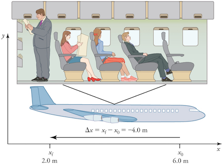
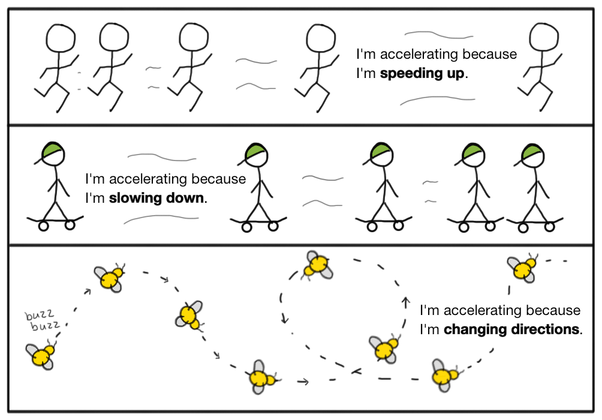

# Physics

[Calculating average velocity or speed](https://www.khanacademy.org/science/physics/one-dimensional-motion/displacement-velocity-time/v/calculating-average-velocity-or-speed)

# One-dimentional motion

## Vectors and scalars

- Vectors: magnitude(size) AND direction
    - displacement: 5 meters to the right
    - velocity: 2.5 meters per second to the right
- Scalars: magnitude(size)
    - distance: 5 meters
    - speed: 2.5 meters per second

## Frame of reference

**Frame of reference (or reference frame)** is a set of criteria or stated values in relation to which measurements or judgments can be made.

## Displacement

Displacement is defined to be the change in position of an object. It can be defined mathematically with the following equation:

## Distance vs. Distance traveled

**Distance** is defined to be the magnitude or size of displacement between two positions. Note that the distance between two positions is not the same as the distance traveled between them.

**Distance traveled** is the total length of the path traveled between two positions. Distance traveled is not a vector. It has no direction and, thus, no negative sign.

It is important to note that the distance traveled does not have to equal the magnitude of the displacement (i.e., distance between the two points). Specifically, if an object changes direction in its journey, the total distance traveled will be greater than the magnitude of the displacement between those two points.

## Instantaneous speed

Speed at a particular moment in time

## Instantaneous velocity

Velocity at a particular moment in time

## Acceleration

Change in velocity over time

Acceleration is the name we give to any process where the velocity changes. Since velocity is a speed and a direction, there are only two ways for you to accelerate: change your speed or change your direction—or change both.

In everyday language people use the word deceleration to describe slowing down. But in physics, we use the single term acceleration to mean any change in velocity, whether it be speeding up, slowing down, or changing direction.

## Projectile

A projectile is any object thrown into space by the exertion of a force. Although any object in motion through space may be called a projectile, the term more commonly refers to a ranged weapon.