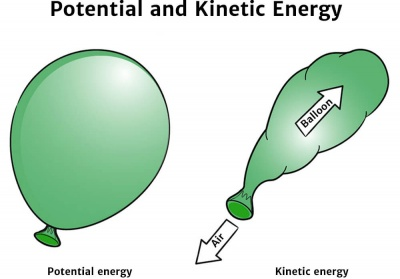
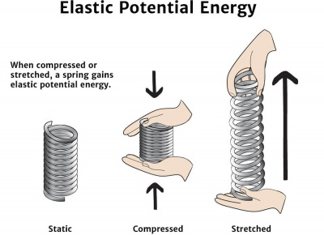

# Potential energy

Potential energy is the **energy stored within an object**, by virtue of the object's position, arrangement or state. The actual potential energy of an object depends on its position relative to other objects.

An inflated balloon has potential energy in the stretched rubber.

# Concept

You can think of potential energy as energy that has the 'potential' to do work. When the position, arrangement or state of the object changes, the stored energy will be released.

*For example, it requires energy to compress a spring – but what happens to that energy once the spring has been compressed? After all, we know that energy **cannot be created or destroyed**, it can only be **converted from one form to another**.*

*Well, in the case of our spring, the kinetic energy used to compress the spring has been converted to potential energy. When we release the spring, the stored potential energy will be converted back into kinetic energy.*

Kinetic energy used to compress a spring is stored as potential energy until released.

# Types

- [Elastic energy](https://en.wikipedia.org/wiki/Elastic_energy) – energy of deformation of a material (or its container) exhibiting a restorative force
- [Gravitational energy](https://en.wikipedia.org/wiki/Gravitational_energy) – potential energy associated with a gravitational field.
- [Nuclear potential energy](https://en.wikipedia.org/wiki/Nuclear_potential_energy)
- Electric potential energy

# References

[Potential Energy](https://www.solarschools.net/knowledge-bank/energy/forms/potential)

[What Is Potential Energy?](https://www.livescience.com/65548-potential-energy.html)

[Outline of energy](https://en.wikipedia.org/wiki/Outline_of_energy)

[Potential energy](https://en.wikipedia.org/wiki/Potential_energy)