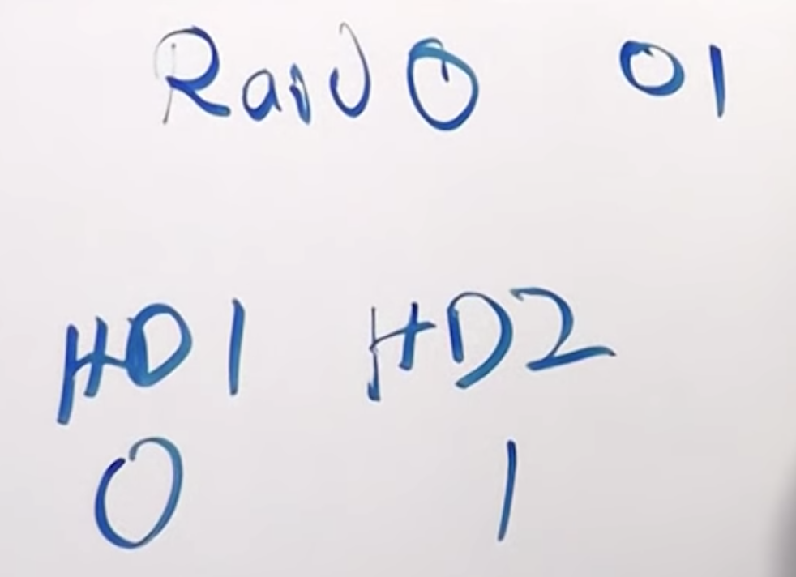
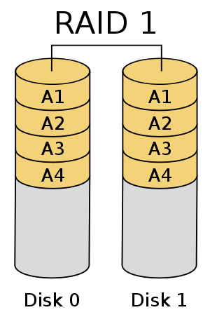
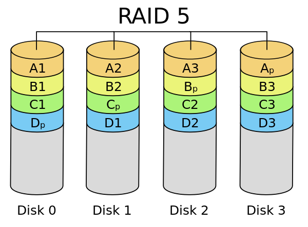
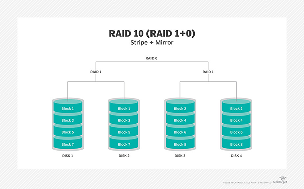

# RAID

RAID (**Redundant Array of Inexpensive Disks** or **Drives**, or **Redundant Array of Independent Disks**) is a data storage virtualization technology that combines multiple physical disk drive components into one or more logical units for the purposes of data redundancy, performance improvement, or both.

# RAID Levels

The standard RAID levels comprise a basic set of RAID configurations that employ the techniques of **striping**, **mirroring**, or **parity** to create large reliable data stores from multiple storages.

## RAID 0

RAID 0 (also known as a **stripe set** or **striped volume**) splits ("**stripes**") data evenly across two or more disks. The failure of one drive will cause the entire array to fail; as a result of having data striped across all disks, the failure will result in **total data loss**.

RAID 0 is normally used to increase performance. A RAID 0 array of n drives provides data read and write transfer rates up to n times as high as the individual drive rates. As a result, RAID 0 is primarily used in applications that require high performance and are able to tolerate lower reliability, such as in scientific computing or computer gaming.

## RAID 1

RAID 1 consists of an exact copy (or **mirror**) of a set of data on two or more disks; a classic RAID 1 mirrored pair contains two disks. The array can only be as big as the smallest member disk.

This layout is useful when read performance or reliability is more important than write performance or the resulting data storage capacity. Any read request can be serviced and handled by any drive in the array; thus, depending on the nature of I/O load, random read performance of a RAID 1 array may equal up to the sum of each member's performance, while the write performance remains at the level of a single disk. However, if disks with different speeds are used in a RAID 1 array, overall write performance is equal to the speed of the slowest disk.

## RAID 5

RAID 5 consists of **block-level striping** with **distributed parity**. Upon failure of a single drive, subsequent reads can be calculated from the distributed parity such that no data is lost. RAID 5 requires at least three disks.

Since parity calculation is performed on the full stripe, small changes to the array experience **write amplification**: in the worst case when a single, logical sector is to be written, the original sector and the according parity sector need to be read, the original data is removed from the parity, the new data calculated into the parity and both the new data sector and the new parity sector are written.

Diagram of a RAID 5 setup with distributed parity with each color representing the group of blocks in the respective parity block (a stripe).

## RAID 10 (RAID 1+0)

Combining RAID 1 and RAID 0, this level is often referred to as RAID 10, which offers higher performance than RAID 1, but at a much higher cost. In RAID 1+0, the **data is mirrored and the mirrors are striped**. Thus, RAID 10 is a **stripe of mirrors**.

In most cases RAID 10 provides **better throughput and latency** than all other RAID levels except RAID 0 (which wins in throughput). Thus, it is the preferable RAID level for **I/O-intensive applications** such as database, email, and web servers, as well as for any other use requiring high disk performance.

# Reference

[RAID - Wikipedia](https://en.wikipedia.org/wiki/RAID)

[Standard RAID levels - Wikipedia](https://en.wikipedia.org/wiki/Standard_RAID_levels)

[Nested RAID levels - Wikipedia](https://en.wikipedia.org/wiki/Nested_RAID_levels)

[What is RAID (redundant array of independent disks)? - Definition from WhatIs.com](https://searchstorage.techtarget.com/definition/RAID)

[RAID Explained: Raid 0, 1, 5 and 10](https://www.youtube.com/watch?v=y71Xf0C3Xf8&t=338s)

[RAID 0, RAID 1, RAID 10 - All You Need to Know as Fast As Possible](https://www.youtube.com/watch?v=eE7Bfw9lFfs)

[What is RAID 0, 1, 5, & 10?](https://www.youtube.com/watch?v=U-OCdTeZLac&t=5s)