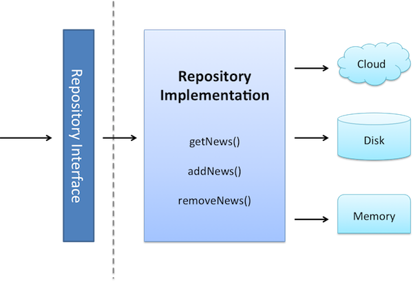
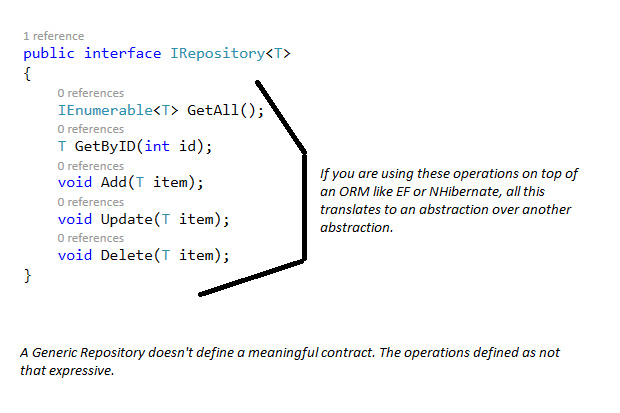

# Repository pattern

The Repository pattern is used to decouple the business logic and the data access layers in your application. A repository mediates between the domain and the data mapping layers of your application. It's supposed to provide you an encapsulation on the way that data is actually persisted in the data storage layer.

# Anti-pattern: The generic repository

A generic repository is a type that comprises of a set of generic methods for performing CRUD operations. It's just another anti pattern and is used frequently with Entity Framework to abstract calls to the data access layer. Using a generic repository is generalization too far.

# Reference

[Getting Familiar With The Awesome Repository Pattern - Kyle Galbraith](https://blog.kylegalbraith.com/2018/03/06/getting-familiar-with-the-awesome-repository-pattern/)

[The evolution of the Repository Pattern - Be aware of over abstraction](http://hannesdorfmann.com/android/evolution-of-the-repository-pattern)

[Design patterns that I often avoid: Repository pattern](https://www.infoworld.com/article/3117713/design-patterns-that-i-often-avoid-repository-pattern.html)