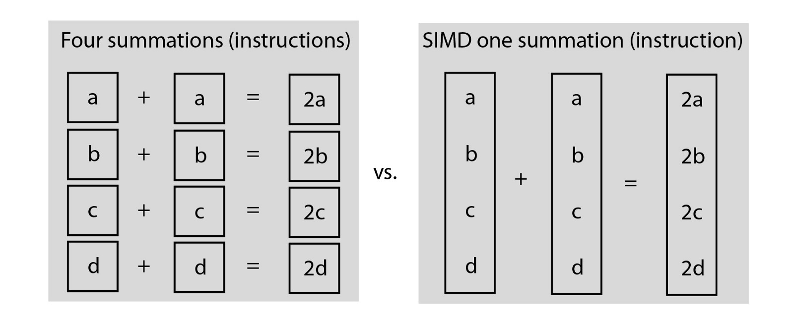
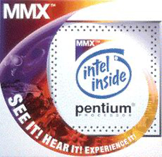
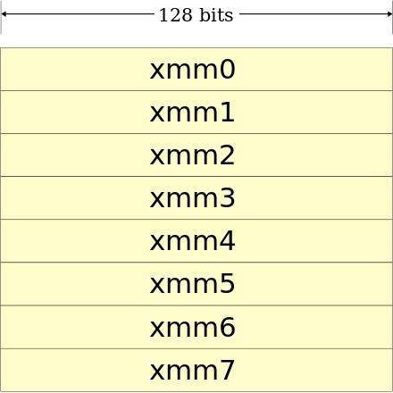
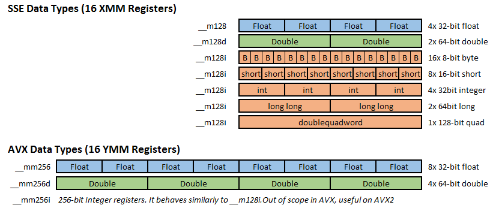
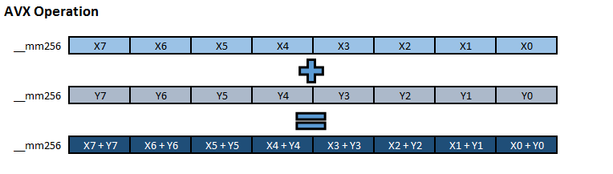
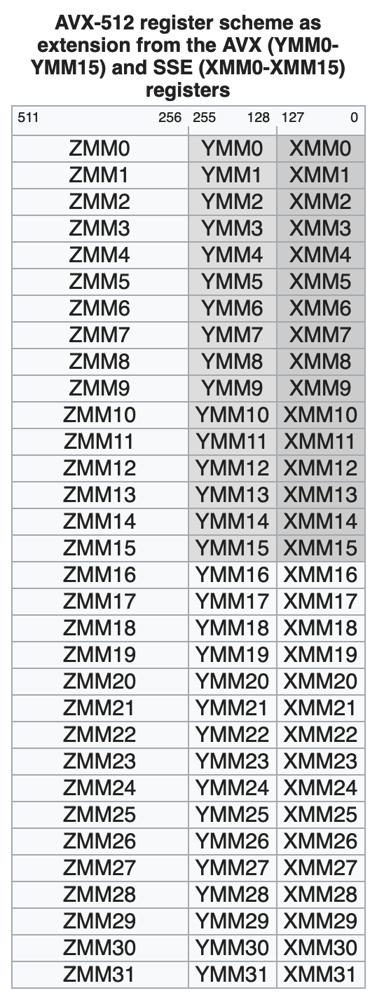
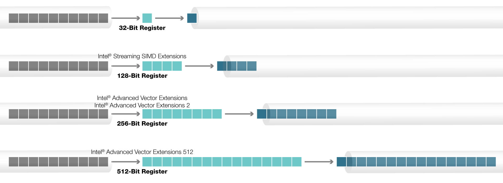
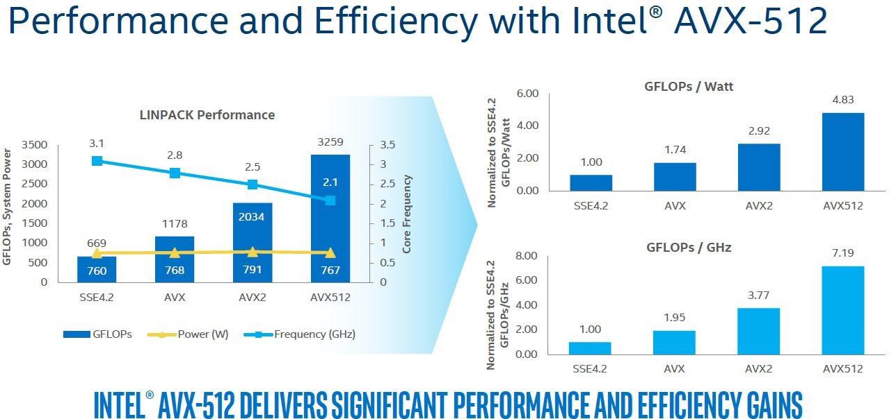

# SIMD

**Single instruction, multiple data (SIMD)** means computer architectures with multiple processing elements that perform the same operation on multiple data points simultaneously.

# MMX (1997)

MMX is Intel's first SIMD instruction set. It is introduced in 1997 with its Pentium line of microprocessors.

## Registers

It has 80-bit registers.

## Naming

MMX is officially a meaningless initialism. Unofficially, the initials have been variously explained as standing for

- MultiMedia eXtension,
- Multiple Math eXtension, or
- Matrix Math eXtension.

## Problems

1. It re-used existing x87 floating point registers making the CPUs unable to work on both floating point and SIMD data at the same time
2. It only worked on integers.

SSE floating point instructions operate on a new independent register set, the XMM registers, and adds a few integer instructions that work on MMX registers.

# SSE (1999 ~ 2006)

**Streaming SIMD Extensions (SSE)** is a SIMD instruction set extension to the x86 architecture designed by Intel. It is introduced in 1999 in their Pentium III series of CPUs. SSE was subsequently expanded by Intel to **SSE2**, **SSE3**, **SSSE3**, and **SSE4**

## Registers

SSE originally added eight new **128-bit registers** known as XMM0 through XMM7. The **AMD64 extensions** from AMD (originally called x86-64) added a further eight registers XMM8 through XMM15, and this extension is duplicated in the Intel 64 architecture.

# AVX (2008)

**Advanced Vector Extensions (AVX),** also known as **Sandy Bridge New Extensions**, are extensions to the x86 instruction set architecture for microprocessors from Intel and AMD proposed by Intel in March 2008 and first supported by Intel with the **Sandy Bridge** processor shipping in Q1 2011 and later on by AMD with the Bulldozer processor shipping in Q3 2011. AVX provides new features, new instructions and a new coding scheme.

## Registers

SSE and AVX have 16 registers each. On SSE they are referenced as XMM0-XMM15, and on AVX they are called YMM0-YMM15. XMM registers are 128 bits long, whereas YMM are 256bit.

- SSE adds three typedefs: `__m128` , `__m128d` and `__m128i`. Float, double (d) and integer (i) respectively.
- AVX adds three typedefs: `__m256` , `__m256d` and `__m256i`. Float, double (d) and integer (i) respectively.

> NOTE: XMM and YMM overlap! XMM registers are treated as the lower half of the corresponding YMM register. This can introduce some performance issues when mixing SSE and AVX code.

## Operations

The cost of executing a single `Add` on a float is similar to executing `VAdd` on 8 floats in AVX.

# AVX2 (2013)

**Advanced Vector Extensions 2 (AVX2)**, also known as **Haswell New Instructions**, is an expansion of the AVX instruction set. AVX2 expands most integer commands to 256 bits and introduces fused multiply-accumulate (FMA) operations.

# AVX-512 (2015)

**AVX-512** are 512-bit extensions to the 256-bit Advanced Vector Extensions SIMD instructions for x86 instruction set architecture (ISA) proposed by Intel. It is supported in **Intel Xeon Scalable Processors** and **Intel Xeon Phi Processor Product Family**.

## Registers

The number 512 refers to the width, in bits, of the **register file**, which sets the parameters for how much data a set of instructions can operate upon at a time. Intel AVX-512 **doubles the width of the register** compared to its predecessor, and it also **doubles the number of registers** to further decrease latency.

## Operations

Intel AVX-512 enables **twice the number of floating point operations per second (FLOPS)** per clock cycle compared to its predecessor, Intel AVX2. A single register under Intel AVX-512 can hold up to **eight double-precision or 16 single-precision floating-point numbers**. Or in other words, Intel AVX-512 enables processing of twice the number of data elements that Intel AVX or Intel AVX2 can process with a single instruction, and four times that of Streaming SIMD Extensions (SSE).

## Performance

# Reference

[MMX (instruction set) - Wikipedia](https://en.wikipedia.org/wiki/MMX_(instruction_set))

[Streaming SIMD Extensions - Wikipedia](https://en.wikipedia.org/wiki/Streaming_SIMD_Extensions)

[Advanced Vector Extensions - Wikipedia](https://en.wikipedia.org/wiki/Advanced_Vector_Extensions)

[Intel® Advanced Vector Extensions 512 (Intel® AVX-512)](https://www.intel.com/content/www/us/en/architecture-and-technology/avx-512-animation.html)

