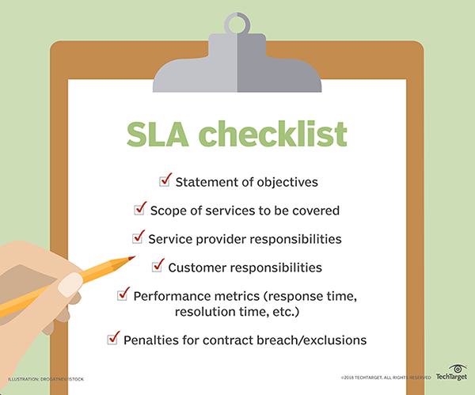

# SLA

A **service-level agreement (SLA)** is a commitment between a service provider and a client. Particular aspects of the service – quality, availability, responsibilities – are agreed between the service provider and the service user.

# Components

A well defined and typical SLA will contain the following components:

- **Type of service to be provided**: It specifies the type of service and any additional details of type of service to be provided. In case of an IP network connectivity, type of service will describe functions such as operation and maintenance of networking equipment, connection bandwidth to be provided, etc.
- **The service's desired performance level, especially its reliability and responsiveness**: A reliable service will be the one which suffers minimum disruptions in a specific amount of time and is available at almost all times. A service with good responsiveness will perform the desired action promptly after the customer requests for it.
- **Monitoring process and service level reporting:** This component describes how the performance levels are supervised and monitored. This process involves gathering of different type of statistics, how frequently this statistics will be collected and how this statistics will be accessed by the customers.
- **The steps for reporting issues with the service**: This component will specify the contact details to report the problem to and the order in which details about the issue have to be reported. The contract will also include a time range in which the problem will be looked upon and also till when the issue will be resolved.
- **Response and issue resolution time-frame**: Response time-frame is the time period by which the service provider will start the investigation of the issue. Issue resolution time-frame is the time period by which the current service issue will be resolved and fixed.
- **Repercussions for service provider not meeting its commitment**: If the provider is not able to meet the requirements as stated in SLA then service provider will have to face consequences for the same. These consequences may include customer's right to terminate the contract or ask for a refund for losses incurred by the customer due to failure of service. Service credits are a typical remedy.
- **Exclusions**: The SLA will also include a section detailing exclusions, that is, situations in which an SLA's guarantees -- and penalties for failing to meet them -- don't apply. The list might include events such as natural disasters or terrorist acts. This section is sometimes referred to as a force majeure clause, which aims to excuse the service provider from events beyond its control.

# Performance metrics

The SLA will typically have a technical definition in **mean time between failures (MTBF)**, **mean time to repair or** **mean time to recovery (MTTR)**; identifying which party is responsible for reporting faults or paying fees; responsibility for various data rates; **throughput**; **jitter**; or similar measurable details.

The key to a service level agreement’s success lies in the metrics that are applied to determine whether the service provider is keeping their end of the bargain. It’s worth remembering the old saw “You get what you measure.”

# Reference

[Service-level agreement - Wikipedia](https://en.wikipedia.org/wiki/Service-level_agreement)

[What is service-level agreement (SLA)? - Definition from WhatIs.com](https://searchitchannel.techtarget.com/definition/service-level-agreement)

[Definition - What is a Service Level Agreement or SLA? - Tallyfy](https://tallyfy.com/service-level-agreement-sla/)

[What is an SLA? Best practices for service-level agreements](https://www.cio.com/article/2438284/outsourcing-sla-definitions-and-solutions.html)