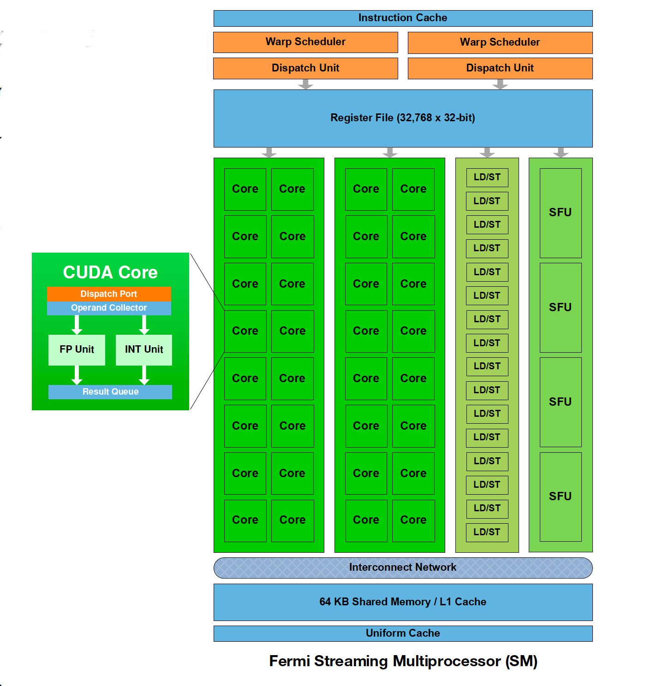

# SM

The streaming multiprocessors (SMs) are the part of the GPU that runs CUDA kernels.

# Inside

Each SM contains the following.

- Thousands of registers that can be partitioned among threads of execution
- Several caches:
    - *Shared memory* for fast data interchange between threads
    - *Constant cache* for fast broadcast of reads from constant memory
    - *Texture cache* to aggregate bandwidth from texture memory
    - *L1 cache* to reduce latency to local or global memory
- *Warp schedulers* that can quickly switch contexts between threads and issue instructions to warps that are ready to execute
- Execution cores for integer and floating-point operations:
    - Integer and single-precision floating point operations
    - Double-precision floating point
    - Special Function Units (SFUs) for single-precision floating-point transcendental functions

# Design

The SMs are general-purpose processors, but they are designed very differently than the execution cores in CPUs: They target much lower clock rates; they support instruction-level parallelism, but not branch prediction or speculative execution; and they have less cache, if they have any cache at all. For suitable workloads, the sheer computing horsepower in a GPU more than makes up for these disadvantages.

# History

The design of the SM has been evolving rapidly since the introduction of the first CUDA-capable hardware in 2006, with three major revisions, codenamed Tesla, Fermi, and Kepler. Compute capability 1.x, 2.x, and 3.x correspond to Tesla-class, Fermi-class, and Kepler-class hardware, respectively.

# SM, SP, blocks, threads, warps

There are multiple streaming multiprocessor on one device. A SM may contain multiple blocks. Each block may contain several threads.A SM have multiple CUDA cores (as a developer, you should not care about this because it is abstracted by warp), which will work on thread. SM always works on warp of threads (always 32). A warp will only working on thread from the same block. SM and block both have limits on number of thread, number of register and shared memory.

# Example

For the GTX 970 there are 13 Streaming Multiprocessors (SM) with 128 **Cuda Cores** each. Cuda Cores are also called **Stream Processors (SP)**.

[GPU Programming and Streaming Multiprocessors | 8.1. Memory | InformIT](http://www.informit.com/articles/article.aspx?p=2103809)

[Streaming multiprocessors, Blocks and Threads (CUDA)](https://stackoverflow.com/questions/3519598/streaming-multiprocessors-blocks-and-threads-cuda)