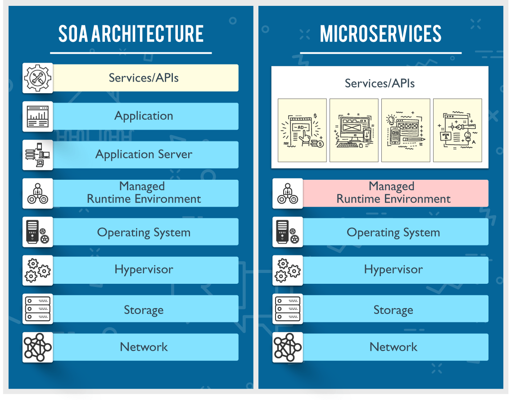
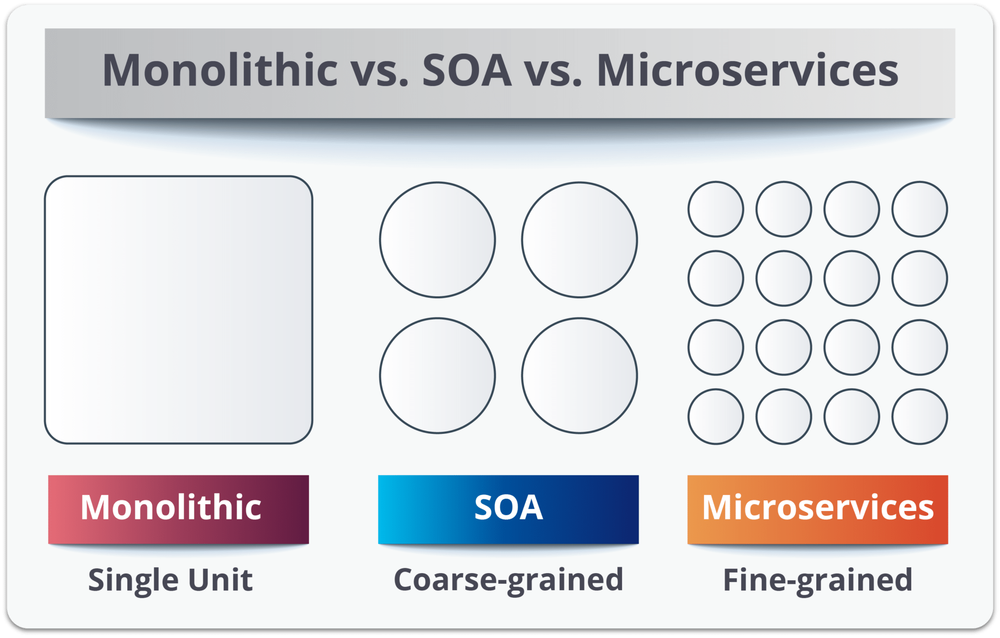

# SOA vs. MSA

Microservices Architecture (MSA) and Service-Oriented Architecture (SOA) both rely on services as the main component. But they vary greatly in terms of service characteristics.

# Key differences

[SOA vs. MSA](https://www.notion.so/19bd120782b540488ac9b3bbdc503e2a)

## **Service Granularity**

Service components within a microservices architecture are generally single-purpose services that do one thing really, really well. With SOA, service components can range in size anywhere from small application services to very large enterprise services. In fact, it is common to have a service component within SOA represented by a large product or even a subsystem.

## **Component Sharing**

Component sharing is one of the core tenets of SOA. As a matter of fact, component sharing is what enterprise services are all about. SOA enhances component sharing, whereas MSA tries to minimize on sharing through “bounded context.” A bounded context refers to the coupling of a component and its data as a single unit with minimal dependencies. As SOA relies on multiple services to fulfill a business request, systems built on SOA are likely to be slower than MSA.

## **Middleware vs API layer**

The microservices architecture pattern typically has what is known as an API layer, whereas SOA has a messaging middleware component. The messaging middleware in SOA offers a host of additional capabilities not found in MSA, including mediation and routing, message enhancement, message, and protocol transformation. MSA has an API layer between services and service consumers.

## **Remote services**

SOA architectures rely on messaging (AMQP, MSMQ) and SOAP as primary remote access protocols. Most MSAs rely on two protocols – REST and simple messaging (JMS, MSMQ), and the protocol found in MSA is usually homogeneous.

## **Heterogeneous interoperability**

SOA promotes the propagation of multiple heterogeneous protocols through its messaging middleware component. MSA attempts to simplify the architecture pattern by reducing the number of choices for integration. If you would like to integrate several systems using different protocols in a heterogeneous environment, you need to consider SOA. If all your services could be exposed and accessed through the same remote access protocol, then MSA is a better option.

# History

## Service-Oriented Architecture

Service oriented architectures were first conceived of in the 1990s but became more widely understood and utilised in the 21st century following the growing prevalence of the internet and internet technologies

## Microservices Architecture

The term "micro web services" was first used by Dr. Peter Rogers during a conference on cloud computing in 2005. "Microservices" themselves premiered at an event for software architects in 2011, where the term was used to describe a style of architecture that many attendees were experimenting with at the time. Netflix and Amazon were among the early pioneers of microservices.

# Reference

[Microservices vs SOA: How Are They Different?](https://www.bmc.com/blogs/microservices-vs-soa-whats-difference/)

[Microservices vs SOA: What's the Difference? - DZone Microservices](https://dzone.com/articles/microservices-vs-soa-whats-the-difference)

[What the hell is... Service Oriented Architecture?](https://airelogic.com/news/what-the-hell-is-service-oriented-architecture/)

[Microservices: What They Are and Why Use Them](https://blog.leanix.net/en/a-brief-history-of-microservices)