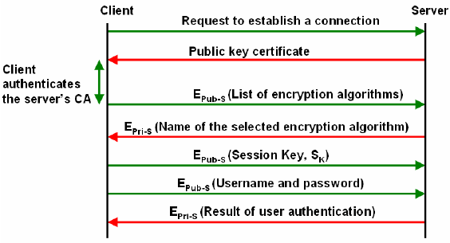
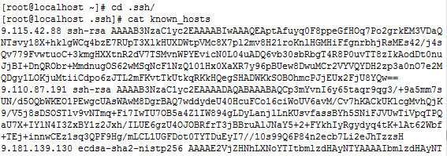
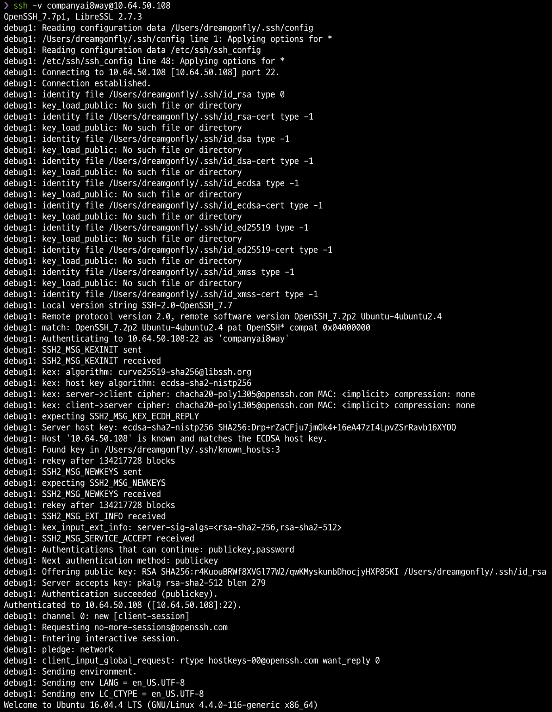

# SSH

SSH, or **Secure Shell**, is a remote administration protocol that allows users to control and modify their remote servers over the Internet. The service was created as a secure replacement for the unencrypted **Telnet** and uses cryptographic techniques to ensure that all communication to and from the remote server happens in an encrypted manner.

Steps to Establish a Secure Shell (SSH) Connection

# SSH keys

SSH keys are an authentication method used to gain access to this encrypted connection between systems. SSH keys always come in pairs, and every pair is made up of a **private key** and a **public key**. SSH keys come in many sizes, but a popular choice is an **RSA 2048-bit** encryption, which is comparative to a **617 digit long** password.

If the private key and the public key remain with the user, this set of SSH keys is referred to as **user keys**. If the private and public key are on a remote system, then this key pair is referred to as **host keys**. Another type of SSH key is a **session key**. When a large amount of data is being transmitted, session keys are used to encrypt this information.

Unlike the general perception, asymmetrical encryption is not used to encrypt the entire SSH session. Instead, it is only used during the key exchange algorithm of symmetric encryption. Before initiating a secured connection, both parties generate temporary public-private key pairs, and share their respective private keys to produce the shared secret key.

# How SSH works

SSH protocol uses **symmetric encryption, asymmetric encryption** and **hashing** in order to secure transmission of information. The SSH connection between the client and the server happens in three stages:

1. Verification of the server by the client.
2. Generation of a session key to encrypt all the communication.
3. Authentication of the client.

## 1. Verification of server

The client initiates a SSH connection with the server. Server listens to default port 22(this port can be changed) for SSH connections. At this point, the server identity is verified. There are two cases:

1. If the client is accessing the server for first time, client is asked to authenticate server manually by verifying public key of server. Public key of server can be found using ***ssh-keyscan*** command or can be found at different places. Once the key is verified, the server is added in ***known_hosts*** file in ~/.ssh directory on client machine. The ***known_hosts*** file contains the information about all the verified servers by the client.
2. If the client is not accessing the server for the first time, the server’s identity is matched with previously recorded information in ***known_hosts*** file for verification.

## 2. Generation of session key

After the server is verified, both the parties negotiate a session key using a version of something called the **Diffie-Hellman key exchange algorithm**. This algorithm is designed in such a way that both the parties contribute equally in generation of **session key**. The generated session key is shared symmetric key i.e. the same key is used for encryption and decryption.

Here is how the algorithm works at a very basic level:

1. Both the client and the server agree on a very large prime number, which of course does not have any factor in common. This prime number value is also known as the **seed value**.
2. Next, the two parties agree on a common encryption mechanism to generate another set of values by manipulating the seed values in a specific algorithmic manner. These mechanisms, also known as encryption generators, perform large operations on the seed. An example of such a generator is **AES (Advanced Encryption Standard)**.
3. Both the parties independently generate another prime number. This is used as a secret private key for the interaction.
4. This newly generated private key, with the shared number and encryption algorithm (e.g. AES), is used to compute a public key which is distributed to the other computer.
5. The parties then use their personal private key, the other machine’s shared public key and the original prime number to create a final shared key. This key is independently computed by both computers but will create the same encryption key on both sides.
6. Now that both sides have a shared key, they can symmetrically encrypt the entire SSH session. The same key can be used to encrypt and decrypt messages.

## 3. Authentication of client

The final stage involves authentication of the client. Authentication is done using **SSH key pair**. After symmetric encryption has been established, the authentication of the client happens as follows:

1. The client begins by sending an ID (public key and hostname) for the key pair it would like to authenticate with to the server.
2. The server checks the `authorized_keys` file of the account that the client is attempting to log into for the key ID.
3. If a public key with matching ID is found in the file, the server generates a random number and uses the public key to encrypt the number and sends this encrypted message.
4. If the client has the correct private key, it will decrypt the message to obtain the random number that was generated by the server.
5. The client combines the obtained random number with the shared session key and calculates the MD5 hash of this value.
6. The client then sends this MD5 hash back to the server as an answer to the encrypted number message.
7. The server uses the same shared session key and the original number that it sent to the client to calculate the MD5 value on its own. It compares its own calculation to the one that the client sent back. If these two values match, it proves that the client was in possession of the private key and the client is authenticated.

Asymmetry of the keys allows authentication of the client because client can only decrypt the messages if it has the correct associated private key.

# Commands

## 1. Generating the SSH key

    ssh-keygen
    # or
    ssh-keygen -t rsa

Once you enter this command, a few new questions will pop up:

`Enter file in which to save the key (/home/tautvydas/.ssh/id_rsa):`

Generally it is recommended to simply leave it as it is (press **ENTER** without typing anything) so that the key generator could create the key pair in the default location.

Second two questions which will pop up:

`Enter passphrase (empty for no passphrase):`

Then:

`Enter same passphrase again:`

Now for convenience reasons, I like to leave those empty as well. That way, after setting the keys up with your remote server, you won’t need to use any kind of password to log in. You will simply enter the `ssh user@serverip` command and it will log you in as long as the keys are properly set up. But if you need even more security, you can enter a passphrase in this section. If you choose this option, you will need to enter the password every time you connect to the remote device.

## 2. Copying the Public key to your remote server

There is a simple command which will put your **public** **key** directly to the remote server’s **authorized_keys** file (this file keeps all the **public** **keys**):

    `ssh-copy-id user@serverip
    #` or
    ssh-copy-id -i ~/.ssh/id_rsa.pub user@serverip

# Verbose mode

# Reference

[SSH Tutorial for Beginners - How Does SSH Work](https://www.hostinger.com/tutorials/ssh-tutorial-how-does-ssh-work)

[Understanding SSH workflow](https://medium.com/@Magical_Mudit/understanding-ssh-workflow-66a0e8d4bf65)

[How to Set Up SSH Keys](https://www.hostinger.com/tutorials/ssh/how-to-set-up-ssh-keys)

[What are SSH Keys? | JumpCloud](https://jumpcloud.com/blog/what-are-ssh-keys/)

