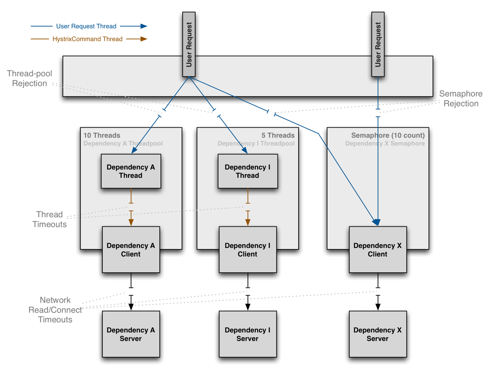

# Semaphore

A semaphore is like an integer, with three differences:

1. The only operations you are allowed to perform are increment (increase by one) and decrement (decrease by one). You cannot read the current value of the semaphore.
2. When a thread decrements the semaphore, if the semaphore is zero ("locked" or "in use" by convention), the thread blocks itself and cannot continue until another thread increments the semaphore.
3. When a thread increments the semaphore, if there are other threads waiting, one of the waiting threads gets unblocked.

# Thread-isolated vs. Semaphore-isolated

1. Calling thread is more expensive than semaphore because of the overhead. So for a large number of requests/second, then semaphore will be something you can consider.
2. With semaphore, the command will be executed within the thread of the caller. It means that the concurrent calls are not fully isolated from other (not like when you use thread).
3. With semaphore, when there is a timeout, it can't be terminated (unless you specifically set it up). If you don't know what will be the client's behavior, then this would be not a nice thing to have.

## Recommendation

> The default, and the recommended setting, is to run HystrixCommands using thread isolation.
Commands executed in threads have an extra layer of protection against latencies beyond what network timeouts can offer.
Generally the only time you should use semaphore isolation for HystrixCommands is when the call is so high volume (hundreds per second, per instance) that the overhead of separate threads is too high; this typically only applies to non-network calls.

# References

[Hystrix! API Gateway를 도와줘! - 우아한형제들 기술 블로그](http://woowabros.github.io/experience/2017/08/21/hystrix-tunning.html)

[Difference between thread-isolated and semaphore-isolated calls](https://stackoverflow.com/questions/35076743/difference-between-thread-isolated-and-semaphore-isolated-calls)

[Mutexes and Semaphores Demystified](https://barrgroup.com/Embedded-Systems/How-To/RTOS-Mutex-Semaphore)