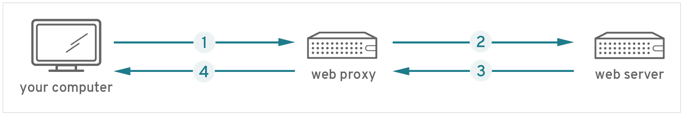
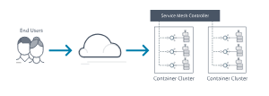
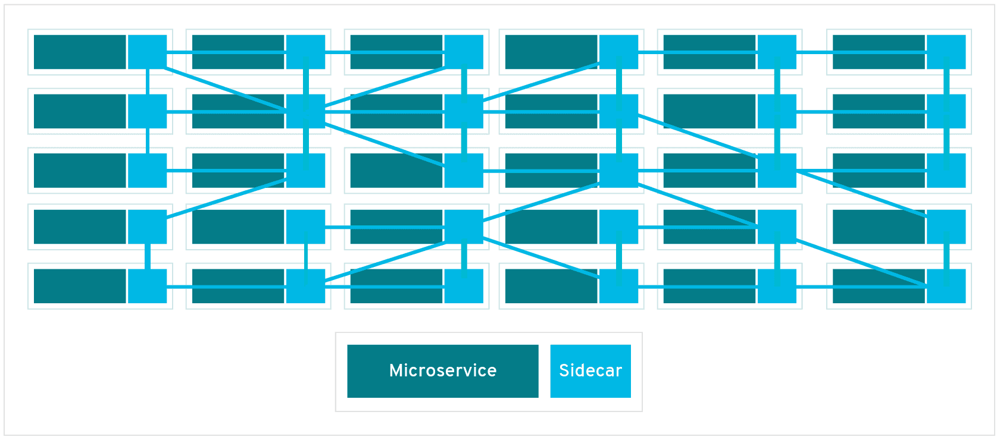
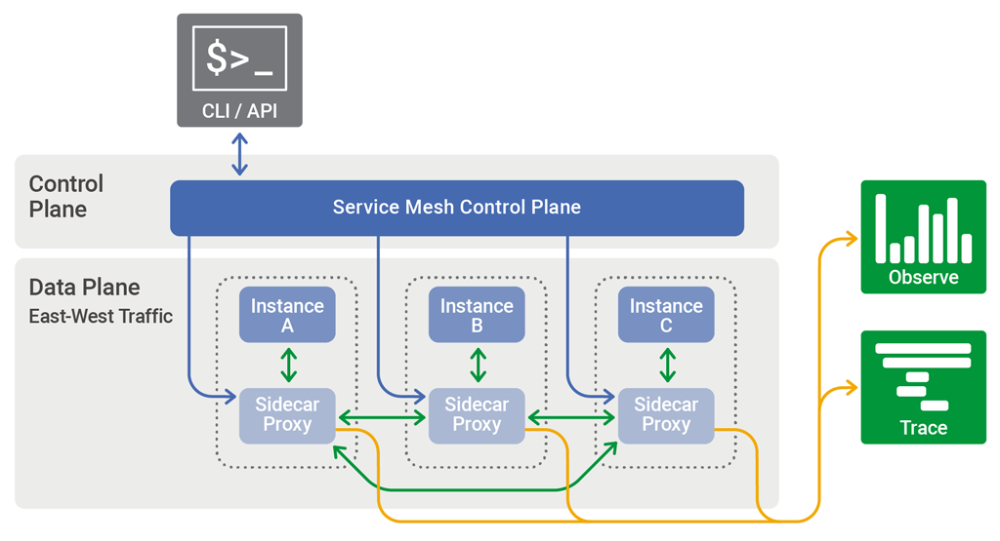

# Service Mesh

A service mesh is a configurable, low‑latency infrastructure layer designed to handle a high volume of network‑based interprocess communication among application infrastructure services using application programming interfaces (APIs).

A service mesh ensures that communication among containerized and often ephemeral application infrastructure services is fast, reliable, and secure. The mesh provides critical capabilities including service discovery, load balancing, encryption, observability, traceability, authentication and authorization, and support for the circuit breaker pattern.

## Side note: what is a mesh?

A mesh is a barrier made of connected strands of metal, fiber, or other flexible or ductile materials. A mesh is similar to a web or a net in that it has many attached or woven strands.

# Sidecar & Mesh network

The service mesh is usually implemented by providing a proxy instance, called a sidecar, for each service instance. Sidecars handle interservice communications, monitoring, and security‑related concerns – indeed, anything that can be abstracted away from the individual services. This way, developers can handle development, support, and maintenance for the application code in the services; operations teams can maintain the service mesh and run the app.

A sidecar proxy sits alongside a microservice and routes requests to other proxies. Together, these sidecars form a **mesh network**.

# Istio

Istio, backed by Google, IBM, and Lyft, is currently the best‑known service mesh architecture. Kubernetes, which was originally designed by Google, is currently the only container orchestration framework supported by Istio.

# Functionalities

- **Container orchestration framework.** As more and more containers are added to an application’s infrastructure, a separate tool for monitoring and managing the set of containers – a *container orchestration framework* – becomes essential. Kubernetes seems to have cornered this market, with even its main competitors, Docker Storm and Mesosphere DC/OS, offering integration with Kubernetes as an alternative.
- **Services and instances (Kubernetes pods).** An *instance* is a single running copy of a microservice. Sometimes the instance is a single container; in Kubernetes, an instance is made up of a small group of interdependent containers (called a *pod*). Clients rarely access an instance or pod directly; rather they access a *service*, which is a set of identical instances or pods (*replicas*) that is scalable and fault‑tolerant.
- **Sidecar proxy.** A *sidecar proxy* runs alongside a single instance or pod. The purpose of the sidecar proxy is to route, or proxy, traffic to and from the container it runs alongside. The sidecar communicates with other sidecar proxies and is managed by the orchestration framework. Many service mesh implementations use a sidecar proxy to intercept and manage all ingress and egress traffic to the instance or pod.
- **Service discovery.** When an instance needs to interact with a different service, it needs to find – discover – a healthy, available instance of the other service. Typically, the instance performs a DNS lookup for this purpose. The container orchestration framework keeps a list of instances that are ready to receive requests and provides the interface for DNS queries.
- **Load balancing.** Most orchestration frameworks already provide Layer 4 (network) load balancing. A service mesh implements more sophisticated Layer 7 (application) load balancing, with richer algorithms and more powerful traffic management. Load‑balancing parameters can be modified via API, making it possible to orchestrate blue‑green or canary deployments.
- **Support for the circuit breaker pattern.** The service mesh can support the circuit breaker pattern, which isolates unhealthy instances, then gradually brings them back into the healthy instance pool if warranted.

# Data plane & Control plane

The part of a service mesh application that manages the network traffic between instances is called the data plane. Generating and deploying the configuration that controls the data plane’s behavior is done using a separate control plane. The control plane typically includes, or is designed to connect to, an API, a command‑line interface, and a graphical user interface for managing the app.

# Reference

[What Is a Service Mesh? - NGINX](https://www.nginx.com/blog/what-is-a-service-mesh/)

[What's a service mesh?](https://www.redhat.com/en/topics/microservices/what-is-a-service-mesh)

[Microservices 101 - What is a Service Mesh for Microservices & Containers](https://avinetworks.com/what-are-microservices-and-containers/)