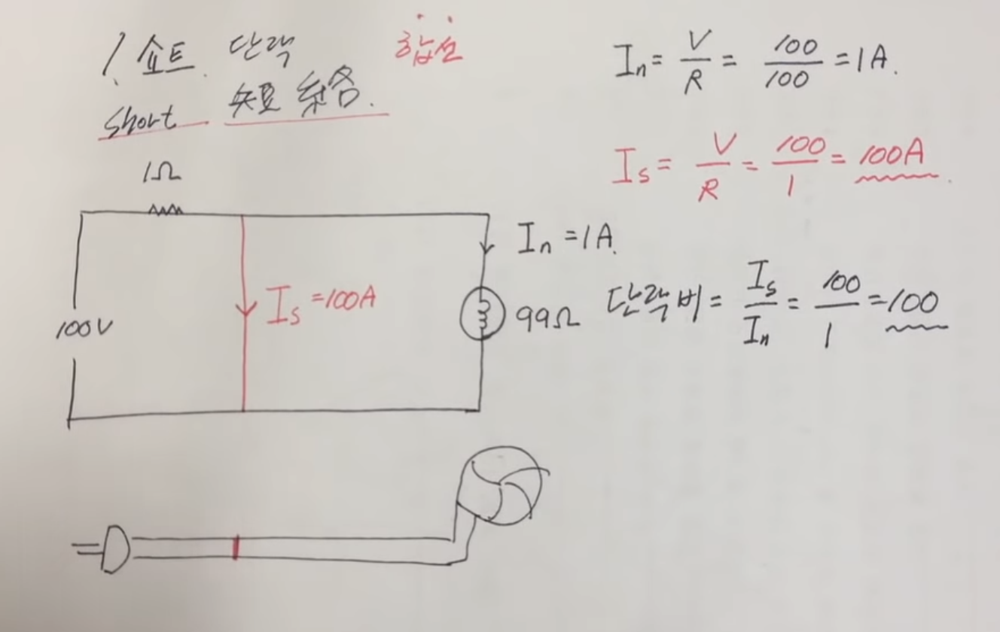

# Short circuit

A short circuit (단락, 短絡, short, s/c) is a condition where electrical flow completes its circuit journey via a shorter distance than is present in the established wiring.

# Reference

[What Causes an Electrical Short Circuit?](https://www.thespruce.com/what-causes-short-circuits-4118973)

[단락이란 무엇인가?](https://www.youtube.com/watch?v=kWTI3sToZjQ)

[Why is a short circuit so dangerous?](https://www.quora.com/Why-is-a-short-circuit-so-dangerous-1)