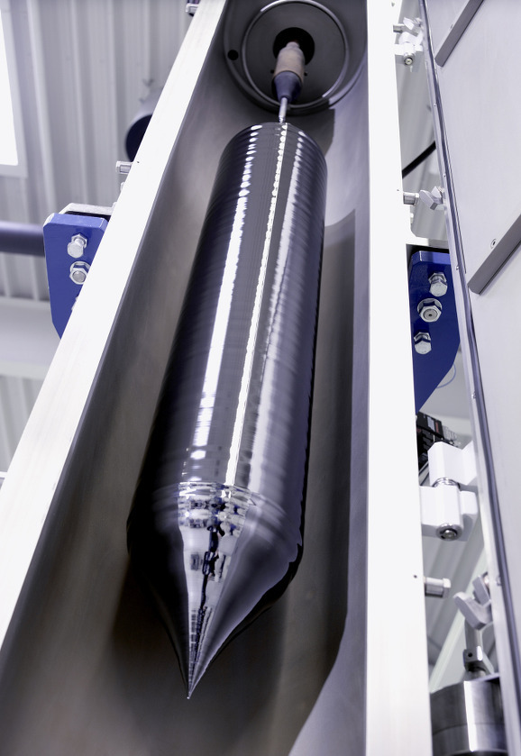
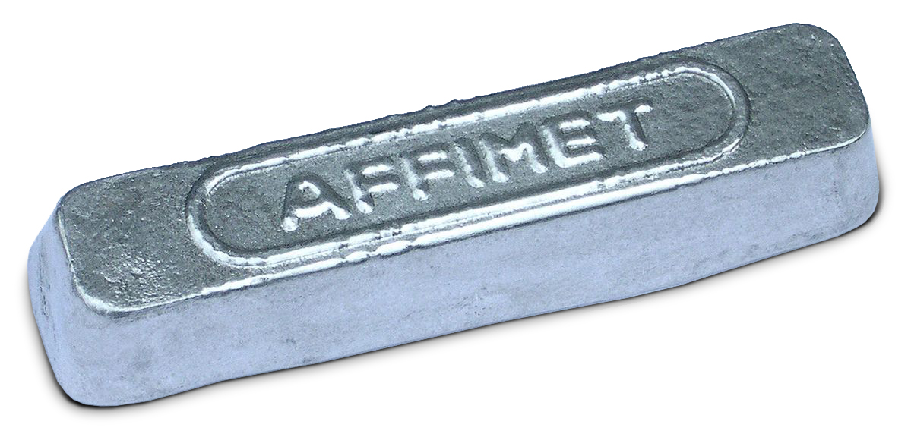
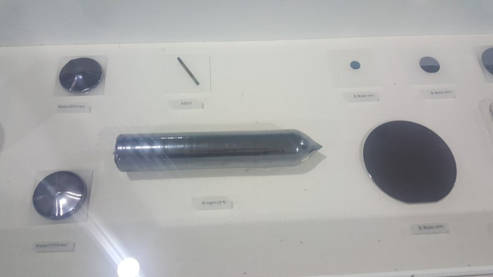

# Silicon ingot

실리콘 잉곳(Silicon ingot)이란 고온에서 녹인 실리콘으로 만든 실리콘 기둥이다.

# 참고

## Definition of ingot

An ingot is a piece of relatively pure material, usually metal, that is cast into a shape suitable for further processing.

Aluminium ingot

# Why silicon?

대부분의 웨이퍼는 실리콘(Si)로 만든다. 그 이유는 실리콘은 모래에서 추출할 수 있어 재료가 풍부하며, 독성이 없어 환경적으로도 우수하기 때문이다.

# Why round?

## **초크랄스키법(Czochralski process)**

모래에서 추출한 실리콘을 고온으로 녹여 고순도의 실리콘 용액을 만들고, 이것을 실리콘 결정 성장기술인 **초크랄스키법(Czochralski)** 또는 플로팅 존법(Floating Zone) 등을 이용하여 실리콘 기둥 즉 잉곳을 만듭니다. 특히, 초크랄스키법을 이용하여 만드는데요, 초크랄스키법이란 실리콘 덩어리를 크리스탈 도가니에 도핑 물질과 함께 넣고 고온으로 가열하여 실리콘 덩어리를 녹인 후, 단결정 실리콘(Seed)물질이 발라진 촉 모양의 봉으로 녹여진 폴리 실리콘(다결정 실리콘) 위를 살짝 찍어서 천천히 회전시키며 당기게됩니다. 그러면 단결정 실리콘(Seed)이 끌어 올려지면서 고상과 액상 사이의 계면에서 냉각이 일어나고 큰 단 결정체가 성장되어 잉곳이 만들어지는 방법입니다.

사진 위 쪽에 막대기처럼 보이는 것이 seed.

# Reference

[Ingot - Wikipedia](https://en.wikipedia.org/wiki/Ingot)

[[반도체 8대 공정] 1탄, '웨이퍼'란 무엇일까요?](https://www.samsungsemiconstory.com/1458)

[Why are silicon wafers round?](https://www.quora.com/Why-are-silicon-wafers-round)

[웨이퍼란 무엇인가? (잉곳 생성)](https://whereisusb.tistory.com/48)