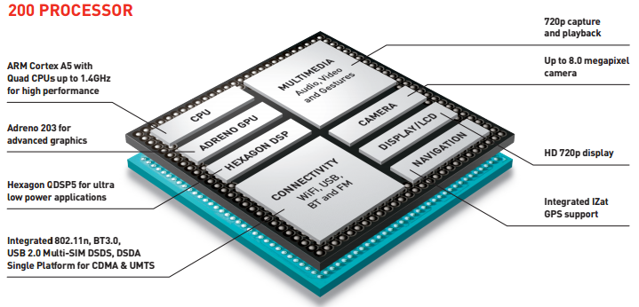
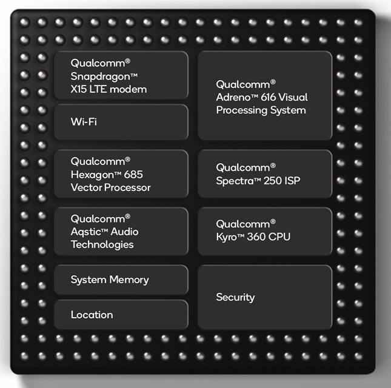
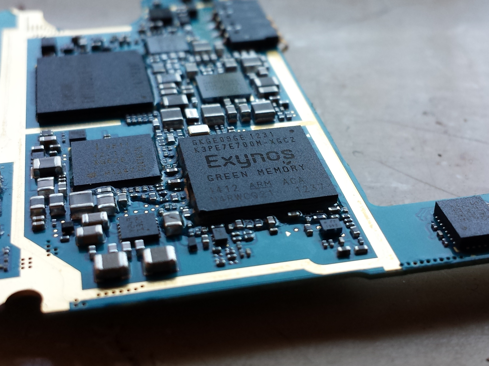

# SoC

**SoC** (**System on a Chip** or **System on Chip**) is an integrated circuit (also known as a "**chip**") that integrates all components of a computer or other electronic system.

# Components

The first part of the term - System - says that it's all about a complex electronic assembly, while the last part - Chip - tells you that all the components of that system are squeezed together on a single integrated circuit, the size of a coin. a SoC could be compared to a miniature system that has a motherboard, a processor, RAN memory, ROM memory, a graphics card, a network card, input/output ports, secondary storage and so on. In contrast, A motherboard would connect these modules as discrete components or expansion cards.

# Advantages & Disadvantages

As they are integrated on a single substrate, SoCs consume much **less power** and take up much **less area** than multi-chip designs with equivalent functionality, at the cost of **reduced replaceability** of components. Because of this, SoCs are very common in the mobile computing (such as in Smartphones) and edge computing markets

# Impact

There has been a general trend towards tighter integration of components in the computer hardware industry, in part due to the influence of SoCs and lessons learned from the mobile and embedded computing markets. Systems-on-Chip can be viewed as part of a larger trend towards **embedded computing, system integration** and **hardware acceleration**.

Intel was the first to move the cache, which used to be an external chip to plug in, onto the CPU. More recently, AMD integrated the memory controller into the CPU die, which used to be a separate chip on the motherboard called **northbridge**.

# Examples

## Snapdragon

Snapdragon is a suite of system on a chip (SoC) semiconductor products for mobile devices designed and marketed by Qualcomm Technologies Inc. The Snapdragon central processing unit (CPU) uses the **ARM RISC instruction set**. A single SoC may include multiple CPU cores, an Adreno graphics processing unit (GPU), a Snapdragon wireless modem, a Hexagon **Digital signal processor (DSP)**, a Qualcomm Spectra **Image Signal Processor (ISP)** and other software and hardware to support a smartphone's **global positioning system (GPS)**, camera, video, audio, gesture recognition and AI acceleration

## Exynos

Exynos (from the Greek words exypnos meaning smart and prasinos meaning green) is a series of **ARM-based** (reduced instruction set) System-on-Chips (SoCs) developed and manufactured by Samsung Electronics.

## A series

The Apple "A" series is a family of "Systems on Chip" (SoC) used in multiple devices, including some of Apple's portable devices such as certain models of the iPhone, iPad, iPod touch, and the Apple TV digital media player. They integrate one or more **ARM-based processing cores (CPU)**, a graphics processing unit (GPU), cache memory and other electronics necessary to provide mobile computing functions within a single physical package. They are designed by Apple, and **manufactured by Samsung and TSMC**.

# Reference

[System on a chip - Wikipedia](https://en.wikipedia.org/wiki/System_on_a_chip)

[System on Chip (SoC) Explained](https://www.youtube.com/watch?v=FUhCrWoNA2c)

[Systems on a Chip (SOCs) as Fast As Possible](https://www.youtube.com/watch?v=L4XemL7t6hg)

[Simple questions: What is a SoC (System on a Chip)? | Digital Citizen](https://www.digitalcitizen.life/soc-system-on-chip)

[Exynos - Wikipedia](https://en.wikipedia.org/wiki/Exynos)

[Apple-designed processors - Wikipedia](https://en.wikipedia.org/wiki/Apple-designed_processors)

[Qualcomm Snapdragon - Wikipedia](https://en.wikipedia.org/wiki/Qualcomm_Snapdragon)

[Qualcomm Snapdragon 710 Brings AI To Mid-Range Smartphones](https://www.cnx-software.com/2018/05/24/qualcomm-snapdragon-710-brings-ai-to-mid-range-smartphones/)