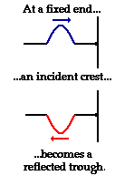
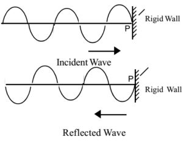
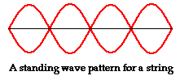
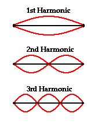

# Standing Wave Patterns

A **standing wave (정상파, 정재파) pattern** is a vibrational pattern created within a medium when the vibrational frequency of the source causes reflected waves from one end of the medium to interfere with incident waves from the source. This interference occurs in such a manner that specific points along the medium appear to be standing still. Because the observed wave pattern is characterized by points that appear to be standing still, the pattern is often called a standing wave pattern.

Incident wave: 입사파
Reflected wave: 반사파
Crest: 마루
Trough: 골

# Diagram

Because the antinodal positions along the guitar string are vibrating back and forth from a large upward displacement to a large downward displacement, the standing wave pattern is often depicted by a diagram such as that shown below.

# Harmonics

Such patterns are only created within the medium at specific frequencies of vibration. These frequencies are known as **harmonic frequencies**, or merely **harmonics**. At any frequency other than a harmonic frequency, the interference of reflected and incident waves leads to a resulting disturbance of the medium that is irregular and non-repeating.

# Natural Frequencies and Vibrational Patterns

So the natural frequencies of an object are merely the harmonic frequencies at which standing wave patterns are established within the object. These standing wave patterns represent the lowest energy vibrational modes of the object. While there are countless ways by which an object can vibrate (each associated with a specific frequency), objects favor only a few specific modes or patterns of vibrating. The favored modes (patterns) of vibration are those that result in the highest amplitude vibrations with the least input of energy. Objects favor these natural modes of vibration because they are representative of the patterns that require the least amount of energy. Objects are most easily forced into resonance vibrations when disturbed at frequencies associated with these natural frequencies.

# Nodal points & antinodal points

The wave pattern associated with the natural frequencies of an object is characterized by points that appear to be standing still. For this reason, the pattern is often called a "**standing wave pattern**." The points in the pattern that are standing still are referred to as **nodal points** or **nodal positions**. These positions occur as the result of the **destructive interference** of incident and reflected waves. Each nodal point is surrounded by **antinodal points**, creating an alternating pattern of nodal and antinodal points.

# Standing Wave Patterns for Vibrating Strings

[https://www.youtube.com/watch?time_continue=208&v=12pjjPIE2IQ](https://www.youtube.com/watch?time_continue=208&v=12pjjPIE2IQ)

# References

[The Physics Classroom Tutorial](https://www.physicsclassroom.com/Class/waves/u10l4b.cfm)

[The Physics of Sound and Music](https://www.physicsclassroom.com/Class/sound/u11l4c.cfm)

[입사파(incident wave)](https://www.scienceall.com/입사파incident-wave/)

[마루(crest)](https://www.scienceall.com/마루crest-2/)

[골(trough)](https://www.scienceall.com/골trough-3/)