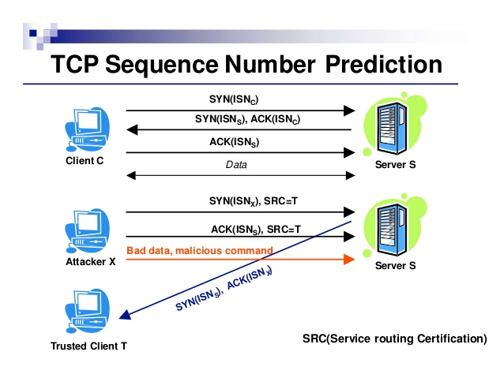

# TCP Sequence Prediction Attack

A TCP sequence prediction attack is an attempt to predict the sequence number used to identify the packets in a TCP connection, which can be used to counterfeit packets.

# Why is Initial Sequence Number(ISN) random?

## To avoid packet conflict

The port numbers in TCP connections come from a finite range and, as such, are reused over time. As such, it is possible that two communicating hosts are using a pair of port numbers that were used in the past. It is conceivable that a packet from the earlier connection is still in flight and might reach the receiver. To reduce the likelihood that the old packet is viewed as part of the ongoing transfer, the starting sequence number changes over time.

## To avoid security problem

what is the issue if we are able to find the initial sequence number? There are ways it can cause security issues like Connection spoofing, connection resetting, and data injection.

### Spoofing Example

    HOST A <----> HOST B
              ^
              |
              |
            HOST C

Here Host A & HOST B are trusted hosts. Host A accepts connections from Host B as it is a trusted source. Here the identification parameter is only the ip address (Example is the **rlogin** application where hosts in the network are trusted & allowed to execute commands. See rlogin to see how it works.)

Now HOST C wants to spoof host B & establish connection with A. The following are steps followed

1. C (spoofing B) ----> sends SYN packet to A with sequence number ISN_C. Spoofing means C sends packets with ip address of B as source ip.
2. A responds to SYN with SYN (ISN_A)+ACK(ISN_C+1) packet with its own sequence number. But this will not reach C. This is because, B is a trusted source & A can send data to B directly. A sends a SYN+ACK packet to B. But B doesnt know anything about this & may choose to reset the connection. At this stage we must keep B busy by overflowing it with junk packets so that it will not respond to A
3. Now C knows ISN_C but it doesnt know ISN_A because it did not receive the packet. If C can predict ISN_A it can send the third ACK packet having acknowledgement number ISN_A+1. With this we have established 3 way handshake with A. (By having a predictable sequence number we can establish a connection.)

Now we can send commands to A from C which it will execute because we are spoofing a trusted source. This is a serious security issue. Likewise we can reset a connection or inject data into the stream.

### Important notes

1. If C is in the same network as of A & B & if it can sniff packets, it can easily see the ISN by just sniffing the packets. Random sequence number does not prevent this. This prevents attack if you are on a different network than A & B.
2. This attack is possible because there is a concept of trusted sources (**rlogin**, **rsh** etc) & does not follow any encryption. If you have any kind of encryption, then this spoofing will not work (Unless you can decrypt that encryption).

# How prominent is this attack in modern systems?

## In the past

An attacker listening into a TCP exchange could in principle determine the flow of sequence numbers by monitoring the packets moving between two hosts in a data exchange. And in fact, [the archives of the Internet Engineering Task Force (IETF)](https://tools.ietf.org/html/rfc6528) from as far back as 1985 describe a situation where a cyber-attack was mounted based on guessing what sequence numbers that Transmission Control Protocol would use for new connections between two known endpoints.

This vulnerability is confirmed in an excerpt from the standards document RFC 793 (Transmission Control Protocol) concerning the generation of TCP sequence numbers, stating that:

“When new connections are created, an initial sequence number (ISN) generator is employed which selects a new 32 bit ISN. The generator is bound to a (possibly fictitious) 32-bit clock whose low order bit is incremented roughly every 4 microseconds. Thus, the ISN cycles approximately every 4.55 hours. Since we assume that segments will stay in the network no more than the Maximum Segment Lifetime (MSL) and that the MSL is less than 4.55 hours we can reasonably assume that ISN’s will be unique.”

Unfortunately, the developers of the BSD Unix TCP/IP stack didn’t adhere to these recommendations. The sequence number for BSD TCP/IP stacks increases by 128,000 every second and by 64,000 for every new TCP connection. Such a sequence is relatively easy to predict and can be much more readily exploited than one which follows the RFC standard. X-Windows, NFS, SunRPC, and many other services which rely upon IP address authentication can be exploited via a successful TCP sequence prediction attack.

## Nowadays

TCP sequence prediction was a hot topic around 2001, but most vendors have patched their OS quite quickly around that time. It is nice to know, but not applicable to systems which have been maintained for the last ten years or so.

# Reference

[security problems in the tcp/ip protocol suite](https://www.slideshare.net/YashKotak6/security-problems-in-the-tcpip-protocol-suite)

[Why in a TCP sequence, is a number taken as a random number and what is the actual number at the start?](https://www.quora.com/Why-in-a-TCP-sequence-is-a-number-taken-as-a-random-number-and-what-is-the-actual-number-at-the-start)

[Anatomy of a TCP Sequence Prediction Attack](https://blog.finjan.com/anatomy-of-a-tcp-sequence-prediction-attack/)

[TCP Sequence Prediction and it's prominence in modern systems/networks](https://security.stackexchange.com/questions/34427/tcp-sequence-prediction-and-its-prominence-in-modern-systems-networks)