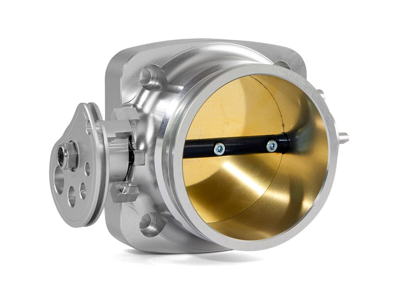
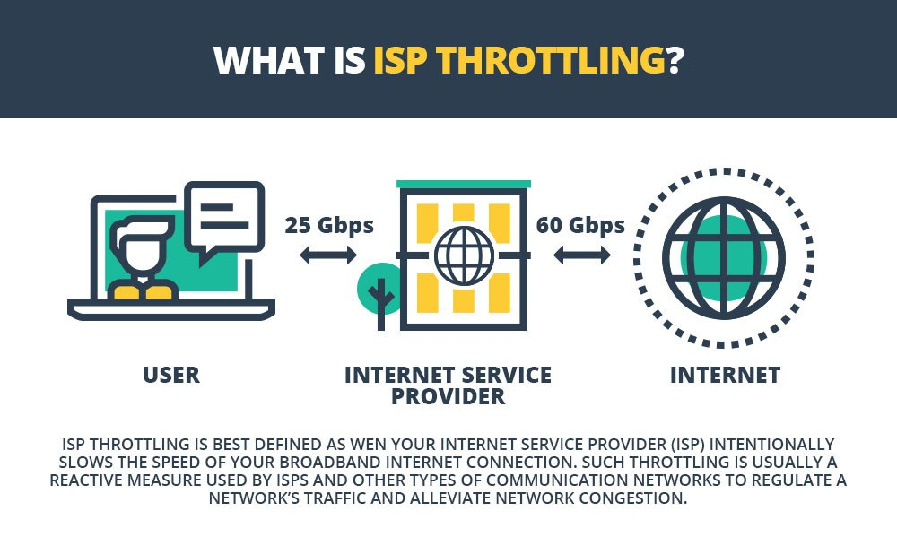
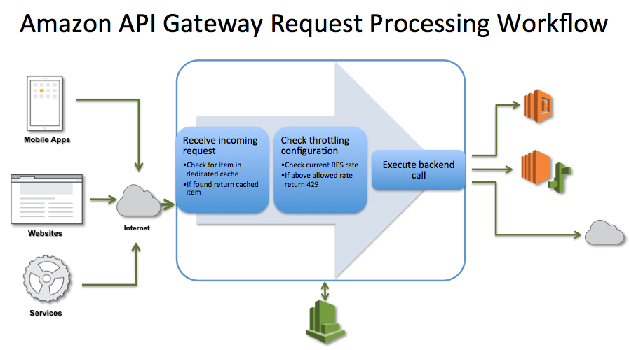

# Throttling

Throttling means regulating the rate at which application processing is conducted.

# What does "Throttle" mean?

A throttle is the mechanism by which fluid flow is managed by the constriction or obstruction.

Throttle body

[https://www.youtube.com/watch?v=wmrvnZT4aDU](https://www.youtube.com/watch?v=wmrvnZT4aDU)

# CPU & GPU throttling

> 인텔이 코어 i9-9900K에 적용한 쓰로틀링은 4가지다.
CPU 발열을 제한하는 쓰로틀링은 기본이고 전류를 제한하는 쓰로틀링에 TDP 한계를 벗어난 소비전력까지 제한하는 쓰로틀링과 메인보드 전원부 온도까지 제한하는 쓰로틀링이 복합적으로 적용 했다. 이 때문에 어느 한 가지만 해당 되도 CPU 속도와 전압이 규정 보다 낮아지고 제 성능을 발휘할 수 없게 된다.

> 쓰로틀링 현상을 확인하는 방법은 여러 가지가 있다.
그 중 가장 간단한 방법은 인텔이 제시한 정규 속도(터보 부스트) 대로 클럭이 유지되는가를 확인하는 것인데 다른 조건은 다 필요 없고 모든 코어가 활성화 된 상태에서 4.7GHz가 유지되는가만 확인하면 된다.
앞서 소개한 4가지 쓰로틀링 조건 중 어느 한가지라도 걸리면 4.7GHz 보다 낮은 속도로 동작한다. 참고로, 필자는 블렌더 랜더링 시 TDP 제한에 걸려 4.05GHz까지 낮아지는 것을 경험하기도 했다.

[인텔 코어 i9-9900K의 숙명 '쓰로틀링', 이제 좀 벗어나자 | 케이벤치](https://kbench.com/?q=node/192662)

# Bandwidth throttling

Bandwidth throttling is a purposeful slowing of available bandwidth.

An ISP might throttle bandwidth during certain times of the day to decrease congestion over their network, which lowers the amount of data they have to process at once, saving them the need to buy more and faster equipment to handle internet traffic at that level.

[What Is Bandwidth Throttling?](https://www.lifewire.com/what-is-bandwidth-throttling-2625808)

# API request throttling

To prevent your API from being overwhelmed by too many requests, Amazon API Gateway throttles requests to your API

Amazon API Gateway provides two basic types of throttling-related settings:

- *Server-side throttling limits* are applied across all clients. These limit settings exist to prevent your API— and your account — from being overwhelmed by too many requests.
- *Per-client throttling limits* are applied to clients that use API keys associated with your usage policy as client identifier.

[처리량 향상을 위해 API 요청 조절 - Amazon API Gateway](https://docs.aws.amazon.com/ko_kr/apigateway/latest/developerguide/api-gateway-request-throttling.html)