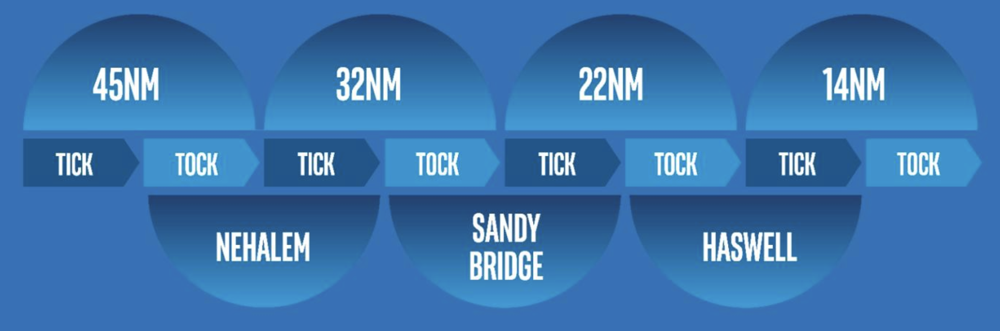
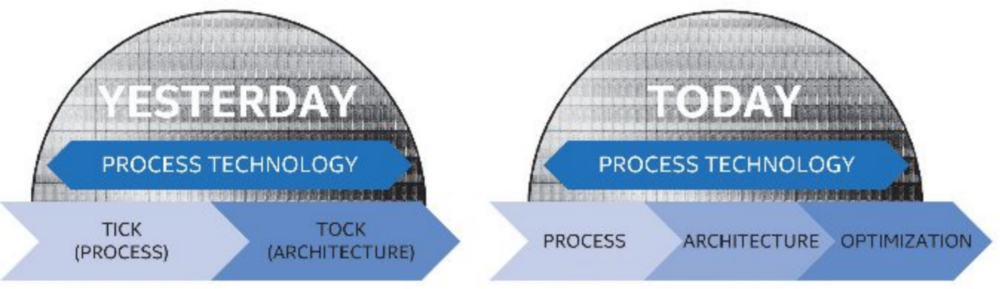

# Tick-tock model vs. Process-Architecture-Optimization model

# Tick-tock model

Tick–tock was a processor development model adopted in 2007 by Intel. Under this model, every **microarchitecture change** (tock) was followed by a **die shrink** of the process technology (tick)

Under the tick-tock scheme roughly every 12-18 months the Intel alternated between "Tick" and "Tock".

### A Tick: Advances Manufacturing Technology

With each tick, Intel advances their **manufacturing process** technology in line with Moore's Law. Each new process introduces higher transistor density and a generally a plethora of other advantages such as higher performance and lower power consumption. During a tick, Intel retrofits their previous microarchitecture to the new process which inherently yielded better performance and energy saving. At this phase, only lightweight features and improvements are introduced.

### A Tock: Delivers New Microarchitecture

With each tock, Intel uses the their latest manufacturing process technology from their "tick" to manufacture a newly designed microarchitecture. The new microarchitecture is designed with the new process in mind and typically introduces Intel's newest big features and functionalities such as hardware-supported video transcoding, encryption/decryption, and other integrated capabilities. New instructions are often added during this cycle stage.

# Process-Architecture-Optimization(PAO) model

Process–architecture-optimization is a processor development model adopted in 2016 by Intel. Under this three-phase model, every die shrink is followed by a microarchitecture change and then by an optimization. The Tick–tock model was replaced because according to Intel the previous model is no longer sustainable.

- **Process** - With each process, Intel advances their manufacturing [process technolog](https://en.wikichip.org/wiki/process_technology)y, just like the "tick" phase in the tick-tock model.
- **Architecture** - With each architecture, Intel uses the their latest manufacturing [process technology](https://en.wikichip.org/wiki/process_technology) from their "process" to manufacture a newly designed [microarchitecture](https://en.wikichip.org/wiki/microarchitecture), just like the "tock" phase in the tick-tock model.
- **Optimization** - With each optimization, Intel improves upon their [previous](https://en.wikichip.org/wiki/intel/microarchitectures) microarchitecture by introducing incremental improvements and enhancements without introducing any large charges. Additionally the process itself enjoys various refinements as it matures. (For example with [Kaby Lake](https://en.wikichip.org/wiki/intel/microarchitectures/kaby_lake), an optimized process called "14 nm+" is used. The enhanced process had a number of transistor-level modifications done to it (e.g. taller fins) allowing for higher frequency at identical voltage levels.)

# Reference

[Tick-tock model - Wikipedia](https://en.wikipedia.org/wiki/Tick%E2%80%93tock_model)

[Intel Tick-Tock Model](https://www.intel.com/content/www/us/en/silicon-innovations/intel-tick-tock-model-general.html)

[Tick-Tock - Intel - WikiChip](https://en.wikichip.org/wiki/intel/tick-tock)

[Process-Architecture-Optimization model - Wikipedia](https://en.wikipedia.org/wiki/Process-Architecture-Optimization_model)

[Process-Architecture-Optimization (PAO) - Intel - WikiChip](https://en.wikichip.org/wiki/intel/process-architecture-optimization)