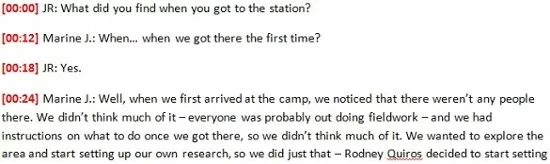
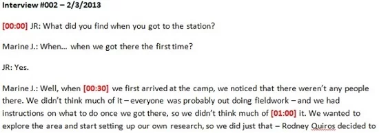
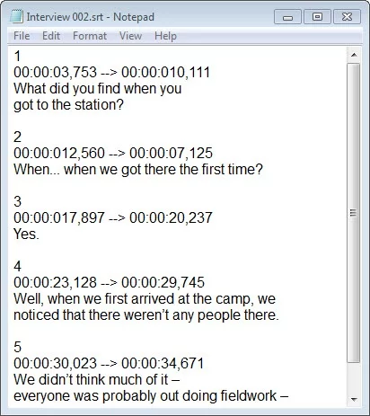

# Time-Stamping, Time-Coding & Spotting

# Time-stamping

This refers to the process of adding **timing markers** – also known as **time-stamps** – to a transcription. The time-stamps can be added at regular intervals, or when certain events happen in the audio or video file.

## Event-based time-stamps

These time-stamps are event-based, meaning that they are inserted every time a specific event happens in the video. In this case that event is a “change of speaker,” but it can be many things, like time-stamping every question in an interview, or time-stamping when a specific person appears in the footage, or when someone speaks in a foreign language, etc.

## Interval-based time-stamps

Time-stamps can also be in intervals, as in the following example:

## Time-stamps are for humans

Both kinds of time-stamps – event and interval-based – are useful for finding content in the source footage. For example, on documentaries directors write editing instructions on the time-stamped transcriptions, which editors can then use to find the footage relatively easily. Same thing with court transcriptions of testimony – lawyers can use the time-stamps to find the exact audio and video they want to play for a jury.

Remember that time-stamps are generally used to help humans navigate through long audio and video files – therefore, they don’t have to be more accurate than minutes and seconds, and they’re attuned to what people actually need to find. Because of this, time-stamp content, interval length, and format can vary, sometimes substantially.

# Time-coding

Unlike time-stamps, **time-codes** are always frame-accurate – that is to say, they also contain frames or milliseconds, and follow a particular format.

## Time-codes are for captioning and subtitling

Time-codes are often gathered for captioning and subtitling.

Note that this isn’t always the case. They have multiple uses, usually ones that require frame-accurate or millisecond-accurate timings.

# Spotting

**Spotting** is collecting time-codes and formatting them specifically for video subtitle services or closed captioning. This means that not only must the time-codes be in the right format, but that the final time-coded file must be formatted also so that it can be used as a captioning or subtitling file.

## Spotting transcription into SRT format

In the following example, we’ve spotted the interview transcription from above into the SRT format:

Note that this spotted file has time-codes for both when caption should appear and when it should disappear, and that it adheres to a strict segmentation. It also breaks down the voice-over transcript into smaller sections, and adds line-breaks, which are preferable for some languages. (For example, most Japanese subtitles deliverables add them.)

# Differences

To start, from the fact that the three terms have much in common. After all, spotting is just a very specific kind of time-coding, and time-coding is most commonly done specifically for spotting projects. In fact, time-coding and spotting are almost always used interchangeably, though spotting is more prevalent in entertainment contexts, while time-coding is more common in online and e-Learning contexts.

In particular, remember that time-stamps standards used for online media platforms – especially for e-Learning and web animations – will not work for spotting.

# References

[Subtitles Translation 101: Time-Stamping, Time-Coding & Spotting](https://www.jbistudios.com/blog/subtitles-translation-101-time-stamping-time-coding-spotting)