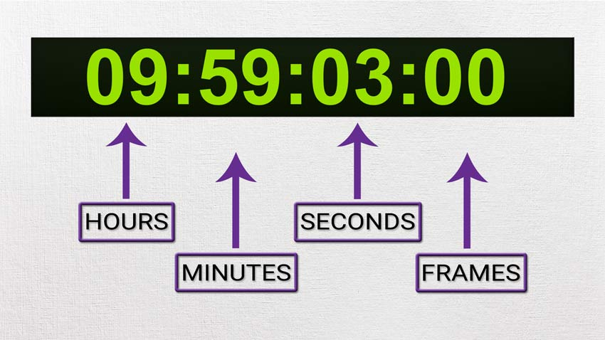

# Timecode

Time-codes are numbers assigned to frames – one per frame, to be precise. They are written as a variation of hours:minutes:seconds;frames, so that a user can tell immediately which frame in a video each time-code refers to.

# Example

For example, the time-code **00:14:56;10** refers to:

**00 hours**

**14 minutes**

**56 seconds**

**10 frames**

If you plug this number into an editing timeline, the program will take you to this exact spot – in a single video, there can be no other spot with this time-code, since frames are the smallest single units of video. This gets to one of one of the core attributes of time-codes – within a video, each one is unique to a single frame. Two frames in a video can’t have the same time-code, and a single time-code can’t refer to two frames in a video.

# SMPTE Timecode

Developed by the Society of Motion Picture and Television Engineers in the late 60’s, SMPTE timecode is essentially a series of numerical codes that can provide integrated systems and their human users with a reliable and accurate positional reference.

It achieves this by indexing every single frame of video with a unique code or address laid out like the diagram above.

# References

[Video Translation 101: What are time-codes? Do they matter? (Yes!)](https://www.jbistudios.com/blog/time-codes-important-for-subtitles-video-translation)

[Timecode - Part 1 - A History And Basic Formats | Pro Tools](https://www.pro-tools-expert.com/home-page/2016/12/6/timecode-101-part-1)