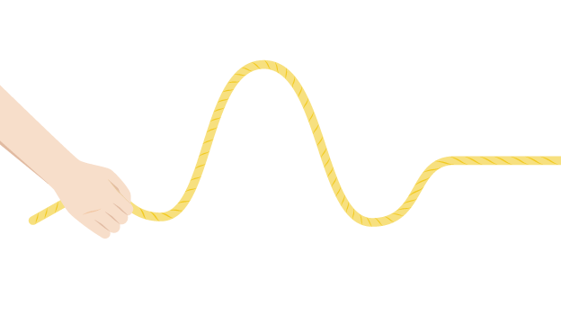
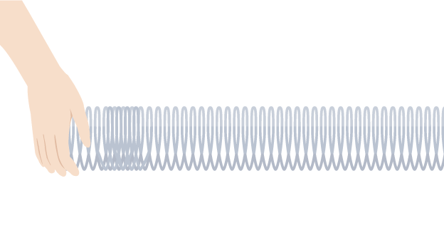

# Transverse and Longitudinal waves

# Definition of wave

Disturbance propagating through space, usually transferring energy.

# Transverse wave (횡파)

Transverse wave is a type of wave where the disturbance (the movement of the medium) is going in a direction at an axis that's transverse to the direction of the wave.

## Transverse wave examples

- ripples on the surface of water
- vibrations in a guitar string
- a Mexican wave in a sports stadium
- electromagnetic waves – eg light waves, microwaves, radio waves
- seismic S-waves

# Longitudinal wave (종파)

Longitudinal wave, or **compression wave**, is a type of wave where the direction of the disturbance is along the same axis as the direction in which the wave is traveling.

## Longitudinal wave examples

- sound waves
- ultrasound waves
- seismic P-waves

# References

[Introduction to waves](https://www.khanacademy.org/science/ap-physics-1/ap-mechanical-waves-and-sound/introduction-to-transverse-and-longitudinal-waves-ap/v/introduction-to-waves)

[Longitudinal and transverse waves - Properties of waves - Edexcel - GCSE Physics (Single Science) Revision - Edexcel - BBC Bitesize](https://www.bbc.co.uk/bitesize/guides/zs86v9q/revision/2)