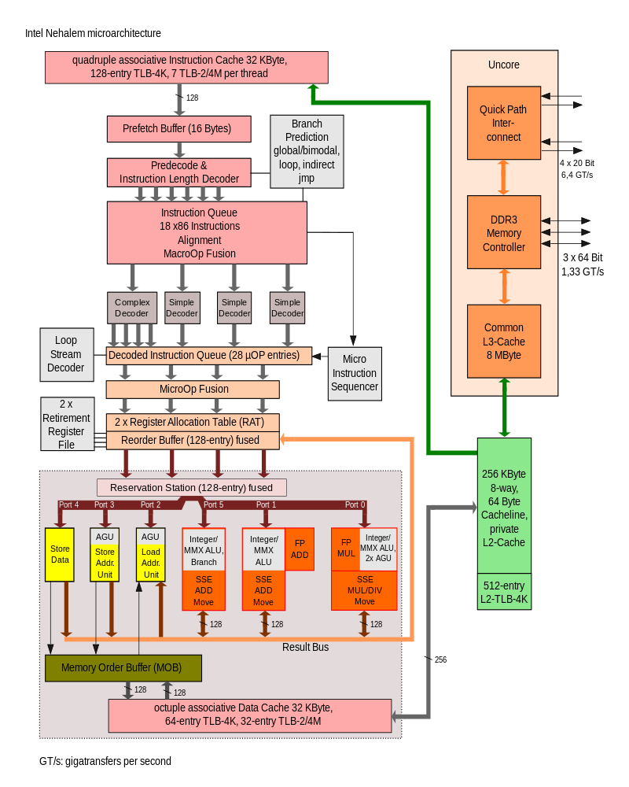
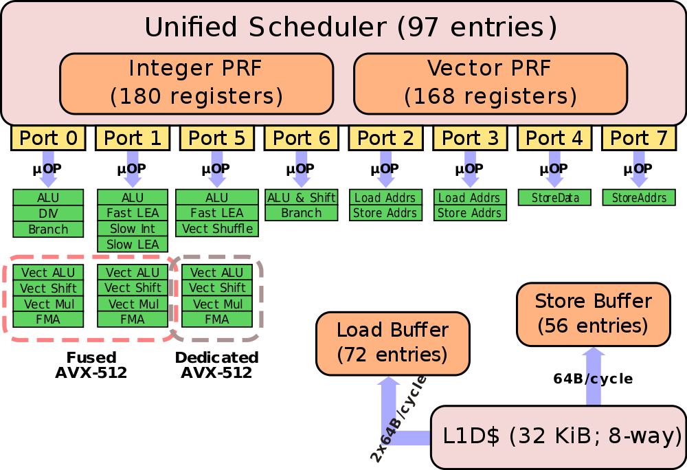

# Unified Reservation station

**Unified Reservation station**, also known as **unified scheduler**, or briefly just **Reservation station**, is a decentralized feature of the microarchitecture of a CPU that allows for **register renaming**, and is used by the **Tomasulo algorithm** for dynamic instruction scheduling.

Reservation stations permit the CPU to fetch and re-use a data value as soon as it has been computed, rather than waiting for it to be stored in a register and re-read. When instructions are issued, they can designate the reservation station from which they want their input to read. When multiple instructions need to write to the same register, all can proceed and only the (logically) last one need actually be written. It checks if the **operands are available (RAW)** and if **execution unit is free (Structural hazard)** before starting execution. Implicitly register renaming solves WAR and WAW hazards.

**Functional Units**, also known as **execution units** (such as an adder or a multiplier), each have their own corresponding Reservation Station. The output of the Functional Unit connects to the **Common Data Bus**, where Reservation Stations are listening for the operands they need.

# Skylake Core

Skylake's scheduler itself was increased by 50%; with up to 97 entries (from 64 in Broadwell) being competitively shared between the two threads. Skylake continues with a unified design; this is in contrast to designs such as AMD's Zen which uses a split design each one holding different types of µOPs. Scheduler includes the two **PRFs(Physical Register Files)** for integers and vectors. It's in those register files that output operand data is store. In Skylake, the integer register file was also slightly increased from 160 entries to 180.

This is the first implementation to incorporate [**AVX-512**](https://en.wikichip.org/wiki/x86/avx-512), a **512-bit [SIMD](https://en.wikichip.org/w/index.php?title=SIMD&action=edit&redlink=1)[x86](https://en.wikichip.org/wiki/x86) instruction set** extension. Intel introduced AVX-512 in two different ways:

In the simple implementation, the variants used in the [entry-level](https://en.wikichip.org/wiki/intel/xeon_bronze) and [mid-range](https://en.wikichip.org/wiki/intel/xeon_silver) Xeon servers, **AVX-512 fuses Port 0 and Port 1** to form a 512-bit unit. Since those two ports are 256-wide, an AVX-512 option that is dispatched by the scheduler to port 0 will execute on both ports. Note that unrelated operations can still execute in parallel. For example, an **AVX-512 operation and an Int ALU operation may execute in parallel** - the AVX-512 is dispatched on port 0 and use the AVX unit on port 1 as well and the Int ALU operation will execute independently in parallel on port 1.

In the [high-end](https://en.wikichip.org/wiki/intel/xeon_gold) and [highest](https://en.wikichip.org/wiki/intel/xeon_platinum) performance Xeons, Intel added a second **dedicated AVX-512 unit** in addition to the fused Port0-1 operations described above. The dedicated unit is situated on Port 5.

Physically, Intel added 768 KiB L2 cache and the second AVX-512 VPU externally to the core.

# Reference

[Reservation station - Wikipedia](https://en.wikipedia.org/wiki/Reservation_station)

[Execution unit - Wikipedia](https://en.wikipedia.org/wiki/Execution_unit)

[Skylake (server) - Microarchitectures - Intel - WikiChip](https://en.wikichip.org/wiki/intel/microarchitectures/skylake_(server))