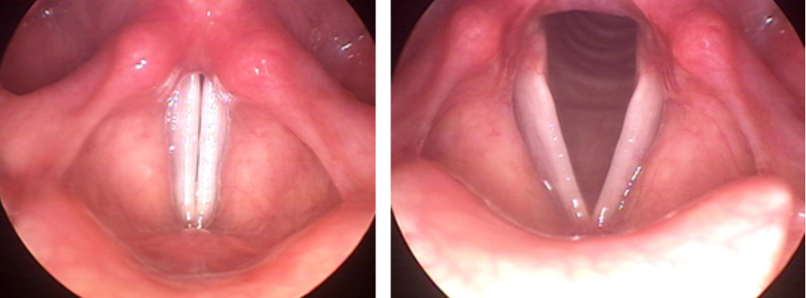
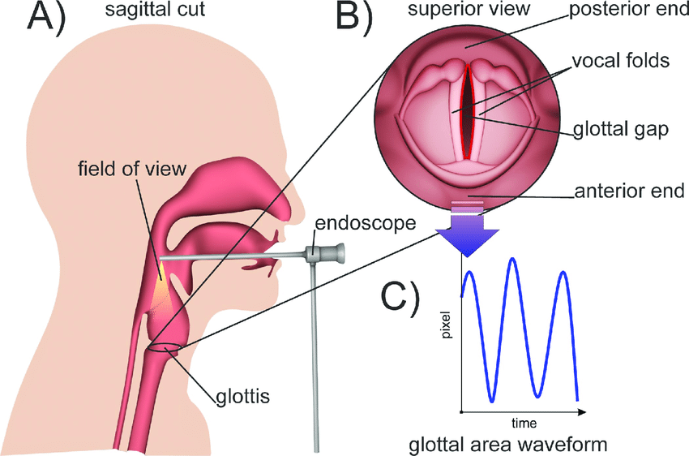
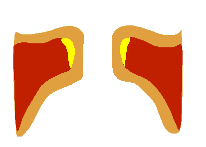

# Vocal folds

The **vocal cords**, also known as **vocal folds**, are folds of tissue in the throat that are key in creating sounds through vocalization. The folds are open when breathing and vibrating for speech or singing.

# Size & pitch

Males and females have different vocal fold sizes. Adult male voices are usually lower pitched due to longer and thicker folds. The male vocal folds are between 1.75 cm and 2.5 cm in length, while female vocal folds are between 1.25 cm and 1.75 cm in length. The vocal folds of children are much shorter than those of adult males and females. The difference in vocal fold length and thickness between males and females causes a difference in vocal pitch.

The perceived pitch of a person's voice is determined by a number of different factors, most importantly the [**fundamental frequency**](https://en.wikipedia.org/wiki/Fundamental_frequency) of the sound generated by the larynx. The fundamental frequency is influenced by the length, size, and tension of the vocal folds. This frequency averages about 125 [Hz](https://en.wikipedia.org/wiki/Hertz) in an adult male, 210 Hz in adult females, and over 300 Hz in children.

# Oscillation

To oscillate, the vocal folds are brought near enough together such that air pressure builds up beneath the larynx (후두). The folds are pushed apart by this increased subglottal pressure, with the inferior part of each fold leading the superior part. Such a wave-like motion causes a transfer of energy from the airflow to the fold tissues. Under the correct conditions, the energy transferred to the tissues is large enough to overcome losses by dissipation and the oscillation pattern will sustain itself. In essence, sound is generated in the larynx by chopping up a steady flow of air into little puffs of sound waves.

# References

[Vocal cords](https://en.wikipedia.org/wiki/Vocal_cords)

[Vocal Cord Dysfunction](https://mvac.com.au/vocal-cord-dysfunction/)

[Learn how VOCAL CORDS work for Speech and Singing | #DrDan 🎤](https://www.youtube.com/watch?v=ZLgAQTMgZ6g)

[The Vocal Organs on Film (From "The Alphabet Conspiracy")](https://www.youtube.com/watch?v=14pwINhOjcc)