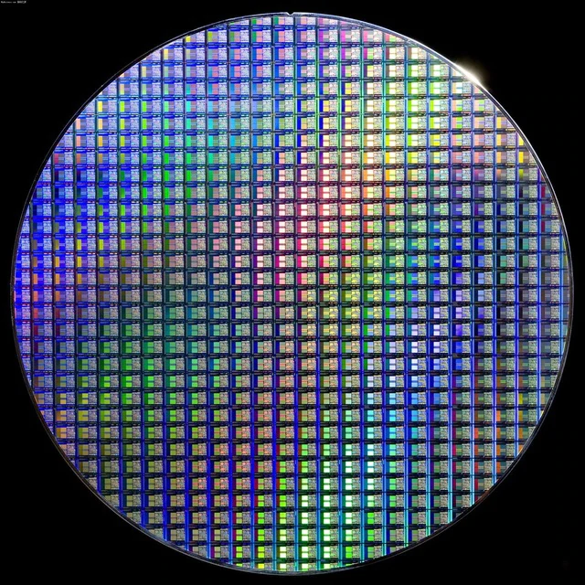
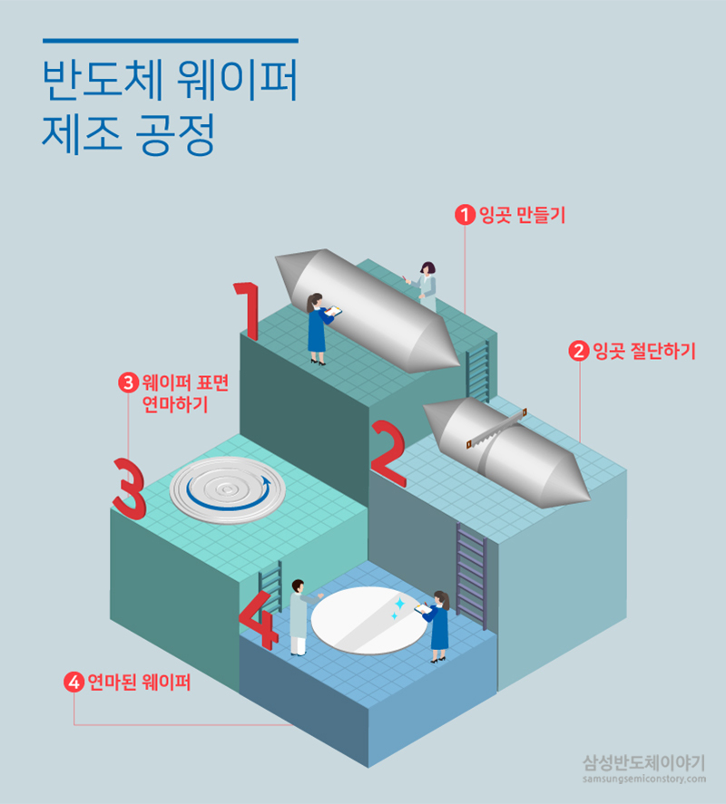
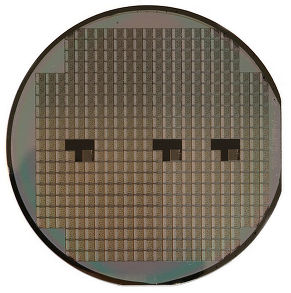
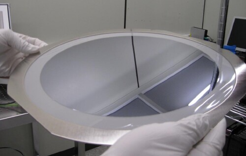
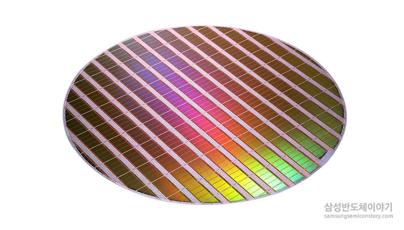
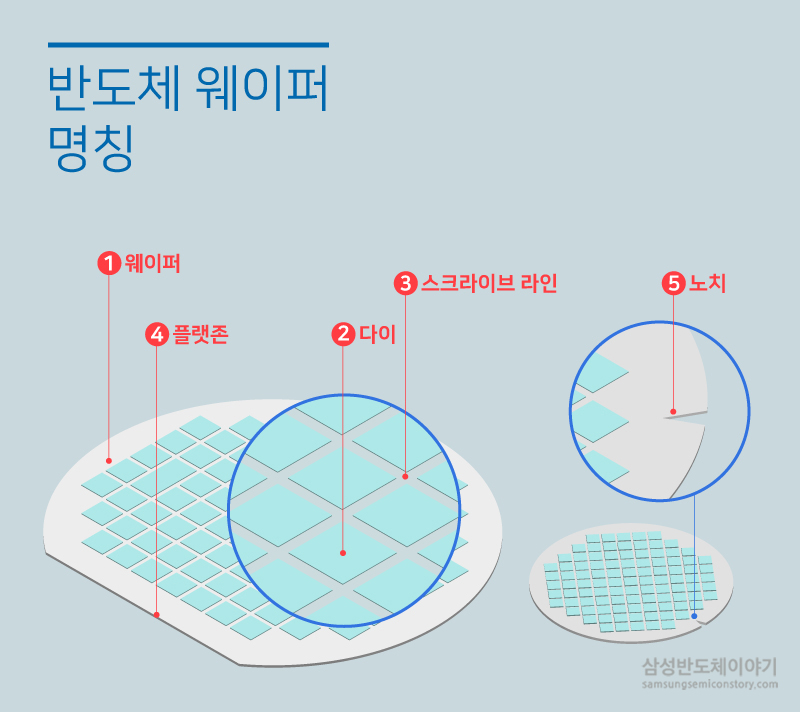

# Wafer

A wafer (also called a **slice** or **substrate**, **기판**) is a thin slice of semiconductor, such as a crystalline silicon (c-Si), used for the fabrication of integrated circuits

# with semiconductor Integrated circuit

반도체 집적회로(Semiconductor Integrated circuit)와 웨이퍼는 어떤 관계일까요? 반도체 집적회로란, 다양한 기능을 처리하고 저장하기 위해 많은 소자를 하나의 칩 안에 집적한 전자부품을 말합니다. 웨이퍼라는 얇은 기판 위에 다수의 동일 회로를 만들어 반도체 집적회로가 탄생되는 만큼, 웨이퍼는 반도체의 기반인 셈이죠. 피자를 만들 때 토핑을 올리기 전, 도우를 만들듯이 말입니다.

# 제조 공정(Process)

## 잉곳(Ingot) 만들기

잉곳의 지름이 웨이퍼의 크기를 결정해 150mm(6인치), 200mm(8인치), 300mm(12인치) 등의 웨이퍼가 되는데요. 현재 300mm(12인치)를 사용하고 있으며 앞으로는 450mm로 사용될 것이라 예상되고 있습니다.

## 얇은 웨이퍼를 만들기 위해 잉곳 절단하기(Wafer Slicing)

단결정 실리콘 봉의 말단과 잉곳의 말단(끝과 끝)을 제거하여 원기둥을 만든 뒤, 앞서 뜨거운 잉곳을 식힌 후 얇게 절단을 해주면 원판 형태의 웨이퍼를 얻을 수 있게 됩니다. 이때는 정밀하게 단단한 물질을 절단해야 하므로 다이아몬드 톱을 이용해서 절단을 해주게 됩니다. (다이아몬드로 이루어진 톱이아닌 톱날의 끝에 다이아몬드가 붙어있습니다.) 톱은 나무를 자를 때와같이 하나씩 자르는 것이 아닌 실이 걸려있듯이 수많은 실톱들이 걸려있고 한꺼번에 많은 양의 Wafer를 절단하여 만들어내게 됩니다.

wafer의 형태로 자르기전에 수평으로 잉곳을 한 번 잘라주게 됩니다. 실리콘의 결정이 만들어지게 될 때 특정 방향을 따라 성장을 하게됩니다. 이러한 방향의 Si wafer의 경우 결정 방향과 서로 직교를 하면 후에 칩을 절단할때, 결정에의한 불필요한 깨짐을 막을 수 있기 때문입니다. 따라서 이러한 방향의 표시를 위해 wafer의 한쪽면을 잘라주게 됩니다.

## 웨이퍼 표면 연마(Lapping&Polishing) 하기

이제까지의 과정을 통해 만들어진 웨이퍼는 표면이 아주 거칠고(톱으로 쑥 잘라 내어서) 울퉁불퉁한 흠결이 많기 때문에 실제 반도체 공정에 이용할 수 없습니다.(그러한 손상은 소자에 해로운 영향을 미칠 수도 있기 때문입니다.) 또한 울퉁불퉁하면 여러 공정에서 문제가 일어날 수 있지만 특히 포토공정(PhotoLithography)에서 이미지를 선명하게 wafer의 표면에 낼 수 없습니다. 따라서 표면을 연마해 주어 매끄럽게 만들어 주어야 합니다. 나무도 이러한 연마를 거처야 가구 같은 용도로 사용할 수 있는 것과 똑같다 보시면 됩니다. 이러한 과정은 **연마액**과 **연마 장비**를 통해 갈아주게 됩니다

# Bare wafer

가공 전의 웨이퍼를 아직 옷을 입지 않은 상태라는 의미로 **베어 웨이퍼(Bare wafer)**라고 한다. 여기에 여러 단계의 물리적, 화학적 가공을 거쳐 표면에 IC를 형성시키고 가공 단계를 거치면 아래와 같은 모습이 된다.

# 구성 요소 명칭

**① 웨이퍼(Wafer):** 반도체 집적회로의 핵심 재료로 원형의 판을 의미합니다.

**② 다이(Die):** 둥근 웨이퍼 위에 작은 사각형들이 밀집돼 있는데요. 이 사각형 하나하나가 전자 회로가 집적되어 있는 IC칩인데, 이것을 다이라고 합니다.

**③ 스크라이브 라인(Scribe Line):** 맨눈으로는 다이들이 서로 붙어있는 듯 보이지만, 사실 다이와 다이들은 일정한 간격을 두고 서로 떨어져 있습니다. 이 간격을 스크라이브 라인이라고 합니다. 다이와 다이 사이에 스크라이브 라인을 두는 이유는, 웨이퍼 가공이 끝난 뒤, 이 다이들을 한 개씩 자르고 조립해 칩으로 만들기 위해서인데요. 다이아몬드 톱으로 잘라낼 수 있는 폭을 두는 것이죠.

**④ 플랫존(Flat Zone):** 웨이퍼의 구조를 구별하기 위해 만든 영역으로 플랫존은 웨이퍼 가공 시 기준선이 됩니다. 웨이퍼의 결정구조는 매우 미세해 눈으로 판단할 수 없기 때문에 이 플랫존을 기준으로 웨이퍼의 수직, 수평을 판단합니다.

**⑤ 노치(Notch):** 최근에는 플랫존 대신 노치가 있는 웨이퍼도 있습니다. 노치 웨이퍼가 플랫존 웨이퍼보다 더 많은 다이를 만들 수 있어 효율이 높습니다.

**엣지 다이(*Edge die)***

둥근 웨이퍼 가장자리에 위치하여 사용하지 못하는 칩(다이)을 엣지 다이(Edge Die)라고 합니다.

# Related industries

반도체 사업에는 웨이퍼를 생산하는 **웨이퍼 산업**과 웨이퍼를 자재로 해 회로를 설계하고 제조하는 웨이퍼 가공산업인 **팹(FAB, Fabrication) 산업**이 있습니다. 또한, 가공된 웨이퍼를 가져다가 다이를 잘라서 습기나 압력에 보호받게 포장(package)하는 **어셈블리(assembly) 사업**도 있습니다.

보통 Fab(Fabrication)은 웨이퍼 위에 반도체 칩을 만드는 전공정 영역을 일컬으며, 패키징과 어셈블리는 가공된 웨이퍼를 바탕으로 개별 칩으로 나눠 포장하고 조립하는 공정 후공정 영역에 속합니다.

# Reference

[[반도체 8대 공정] 1탄, '웨이퍼'란 무엇일까요?](https://www.samsungsemiconstory.com/1458)

[Wafer (electronics) - Wikipedia](https://en.wikipedia.org/wiki/Wafer_(electronics))