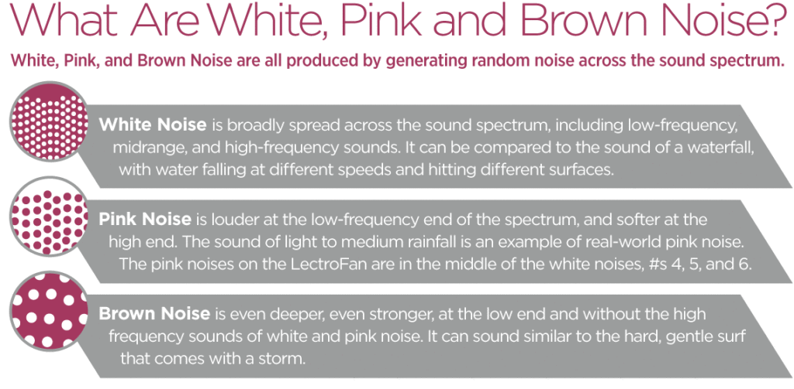

# White noise, pink noise & brown noise

# White noise

**White noise** is a random signal having equal intensity at different frequencies. White noise is used to mask background noises in the office, or to aid in sleep. White noise draws its name from white light, although light that appears white generally does not have a flat power spectral density over the visible band.

# Pink noise

Although all frequencies are produced in equal intensity, white noise sounds much brighter than what we would expect from a spectrally flat noise. This is due to the nature of our hearing, which doesn't sense all frequencies equally. Therefore, people often prefer to listen to **Pink Noise**, a noise that boosts the lower frequency range to compensate for the unnatural brightness of white noise. 

Pink noise or **​1⁄f noise** is a signal or process with a frequency spectrum such that the power spectral density (energy or power per frequency interval) is inversely proportional to the frequency of the signal. In pink noise, each octave (halving/doubling in frequency) carries an equal amount of noise energy.

The [human auditory system](https://en.wikipedia.org/wiki/Human_auditory_system), which processes frequencies in a roughly logarithmic fashion does not perceive different frequencies with equal sensitivity; signals around 1–4 kHz sound [loudest](https://en.wikipedia.org/wiki/Loudness) for a given intensity.

In pink noise, there is equal energy in all [octaves](https://en.wikipedia.org/wiki/Octave) (or similar log bundles) of frequency. In terms of power at a constant bandwidth, pink noise falls off at 3 [dB](https://en.wikipedia.org/wiki/Decibel) per octave. At high enough frequencies pink noise is never dominant.

The name arises from the pink appearance of visible light with this power spectrum.

# Brown noise

**Brown Noise**, a noise that puts even more emphasis on the lower frequencies. In science, Brownian noise, also known as Brown noise or red noise, is the kind of signal noise produced by Brownian motion, hence its alternative name of random walk noise. The term "Brown noise" does not come from the color, but after Robert Brown, who documented the erratic motion for multiple types of inanimate particles in water. The term "red noise" comes from the "white noise"/"white light" analogy; red noise is strong in longer wavelengths, similar to the red end of the visible spectrum.

# References

[The Ultimate White Noise Generator * Design Your Own Color](https://mynoise.net/NoiseMachines/whiteNoiseGenerator.php)

[White, Pink, and Brown Noise: What's the difference? - Sound of Sleep](https://www.soundofsleep.com/2017/07/18/white-pink-brown-noise-whats-difference/)

[White noise](https://en.wikipedia.org/wiki/White_noise)

[Pink noise](https://en.wikipedia.org/wiki/Pink_noise)

[Brownian noise](https://en.wikipedia.org/wiki/Brownian_noise)