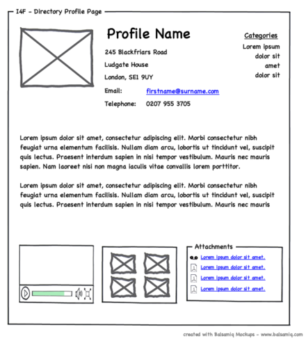
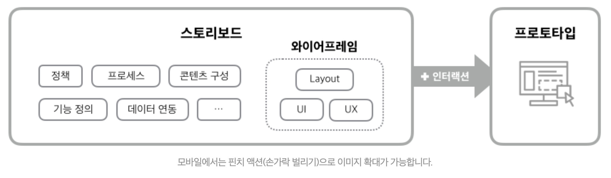
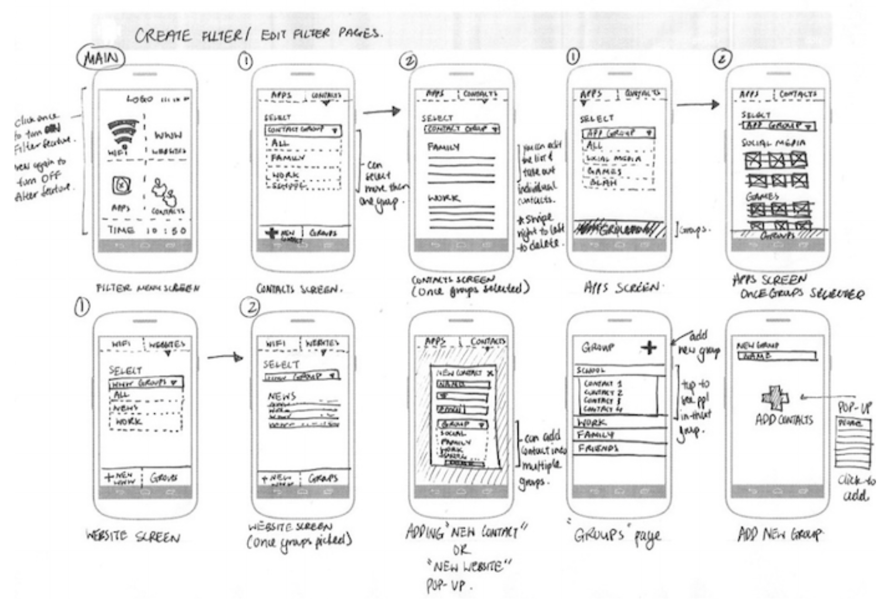
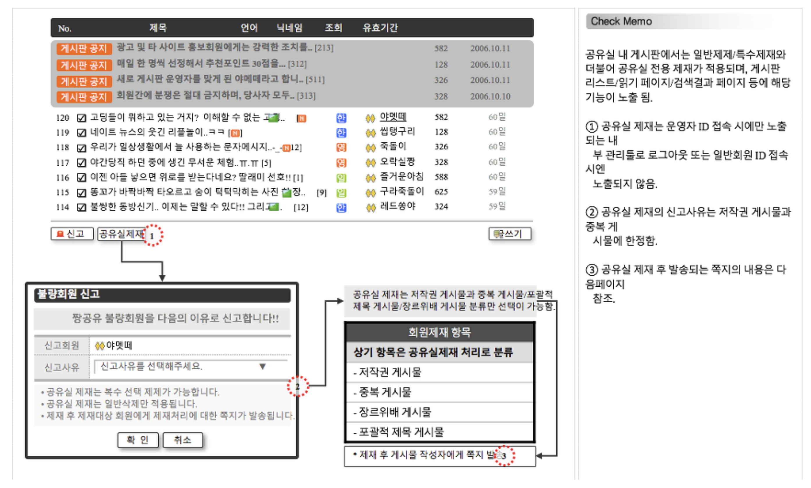

# Wireframe

A **website wireframe**, also known as a **page schematic** or **screen blueprint**, is a visual guide that represents the skeletal framework of a website.

# Appearance

Wireframes are simple black and white layouts that outline the specific size and placement of page elements, site features, conversion areas and navigation for your website. They are devoid of color, font choices, logos or any real design elements that take away from purely focusing on a site’s structure.

We often say that they are much like a blue print to a home, where you can easily see the structural placement of your plumbing, electrical and other structural elements without any interior design treatments.

# Purpose

The reason we make wireframes is not just to have a skeleton for the UI design, but to be able to quickly iterate, modify and get feedback on your design. Wireframe encourages people to comment on how things actually work, how the screens connect and what the structure of the page looks like.

# Focus

- The range of functions available
- The relative priorities of the information and functions
- The rules for displaying certain kinds of information
- The effect of different scenarios on the display

# Wireframe vs. storyboard vs. prototype

## Wireframe

와이어프레임은 화면 단위의 레이아웃을 설계하는 작업입니다. 의사소통 관계자들과 레이아웃을 협의하거나 서비스의 간략한 흐름을 공유하기 위해 사용합니다. UI, UX 설계에 집중되어 있습니다.

## Storyboard

디자이너/개발자가 참고하는 최종적인 산출문서로써 정책, 프로세스, 콘텐츠 구성, 와이어프레임(UI, UX), 기능 정의, 데이터베이스 연동 등 서비스 구축을 위한 모든 정보가 담겨 있는 문서입니다. 해당 문서를 바탕으로 커뮤니케이션을 진행합니다.

## Prototype

프로토타입은 실제 서비스와 흡사한 모형을 만드는 작업입니다. 정적인 화면으로 설계된 와이어프렝미 또는 스토리보드에 인터렉션을 적용함으로써 실제 구현된 것처럼 시뮬레이션 할 수 있으며, 사용자 경험에 대한 테스트를 진행해볼 수 있습니다.

# References

[Why you shouldn't skip your wireframing](https://blog.prototypr.io/why-you-shouldnt-skip-your-wireframing-1f7a70d5c125)

[[디자인] 와이어 프레임을 절대 건너 뛰지 않아야하는 이유](https://www.vobour.com/-%EB%94%94%EC%9E%90%EC%9D%B8-%EC%99%80%EC%9D%B4%EC%96%B4-%ED%94%84%EB%A0%88%EC%9E%84%EC%9D%84-%EC%A0%88%EB%8C%80-%EA%B1%B4%EB%84%88-%EB%9B%B0%EC%A7%80-%EC%95%8A%EC%95%84%EC%95%BC%ED%95%98%EB%8A%94-%EC%9D%B4%EC%9C%A0)

[What is wireframing | Experience UX](https://www.experienceux.co.uk/faqs/what-is-wireframing/)

[[웹 기획] 화면 설계 용어 - 와이어프레임, 스토리보드, 프로토타입의 차이점](https://yslab.kr/74)

[와이어프레임과 프로토타입에 대한 모든 것 | Creative Dialogue](https://blogs.adobe.com/creativedialogue/design-ko/everything-you-need-to-know-about-wireframes-and-prototypes/)