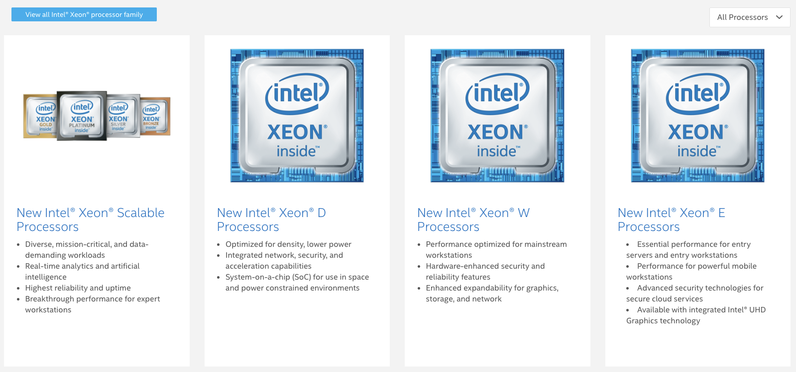
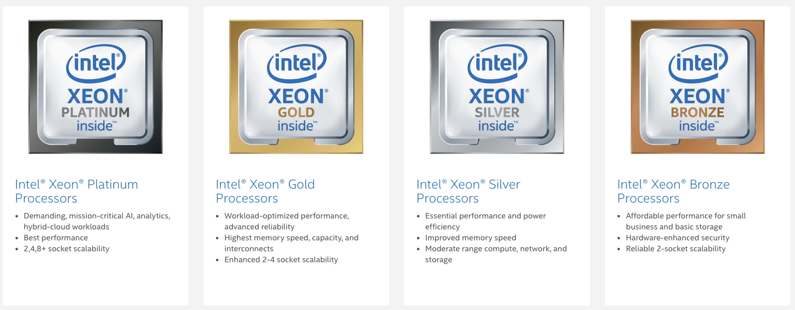
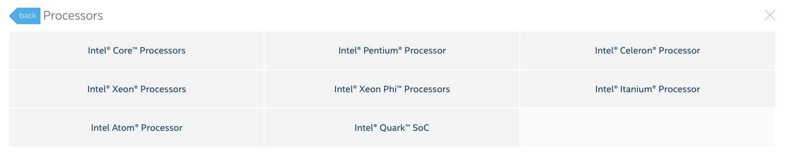

# Xeon

Xeon (/ˈziːɒn/ ZEE-on) is a brand of x86 microprocessors designed, manufactured, and marketed by Intel, targeted at the non-consumer workstation, server, and embedded system markets. It was introduced in June 1998. Xeon processors are based on the same architecture as regular desktop-grade CPUs, but have some advanced features.

# Advantages

- higher core counts
- support for larger amounts of RAM
- larger cache memory
- extra provision for enterprise-grade reliability, availability and serviceability features responsible for handling hardware exceptions
- higher performance to price ratio vs. the Core i7 in terms of total computing power of all core

# Disadvantages

- lower clock rates at the same price point
    - since servers run more tasks in parallel than desktops, core counts are more important than clock rates
- lack of support for overclocking
- require a discrete graphics card or a separate GPU if computer monitor output is desired.

# vs. Xeon Phi

Intel Xeon is a distinct product line from the similarly-named Intel Xeon Phi. The first-generation Xeon Phi is a completely different type of device more comparable to a graphics card; it is designed for a PCI Express slot and is meant to be used as a multi-core coprocessor, like the Nvidia Tesla. In the second generation, Xeon Phi evolved into a main processor more similar to the Xeon. It conforms to the same socket as a Xeon processor and is x86-compatible; however, as compared to Xeon, the design point of the Xeon Phi emphasizes more cores with higher memory bandwidth.

# Xeon Scalable Processors

# Intel's processors

[Intel product specifications](https://ark.intel.com/content/www/us/en/ark.html#@Processors)

# Reference

[Xeon - Wikipedia](https://en.wikipedia.org/wiki/Xeon)

[Intel and Facebook* collaborate to boost PyTorch* CPU performance](https://software.intel.com/en-us/articles/intel-and-facebook-collaborate-to-boost-pytorch-cpu-performance?utm_source=social-facebook&utm_medium=fb4d&utm_campaign=organic&utm_content=post-url&utm_offering=artificial-intelligence&utm_product=intel_040919&fbclid=IwAR35PbR09nto3YATaS2SJk1Rs_EzNIdj219bJTfARQvgLQyjvnH2oqweZHw)