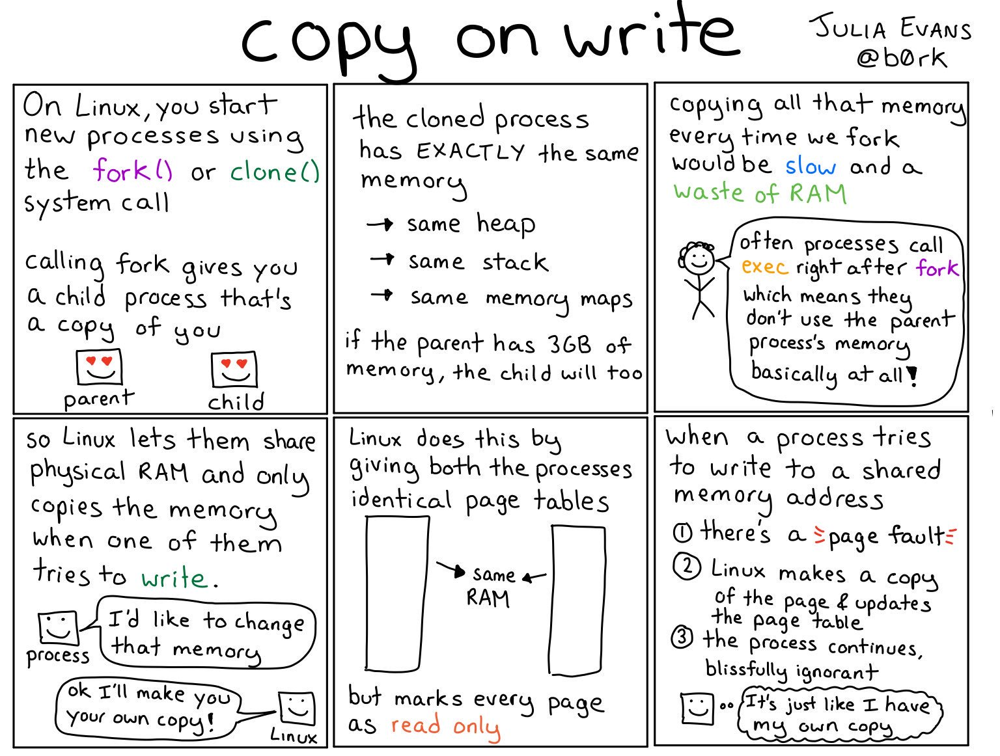

# copy-on-write

With **Copy-on-write (CoW or COW)**, sometimes referred to as **implicit sharing** or **shadowing**, when a **fork() system call** occurs, the parent process's pages are shared between the child and the parent process. Whenever a process (parent or child) modifies a page, a separate copy of that particular page alone is made for that process (parent or child) which performed the modification.

