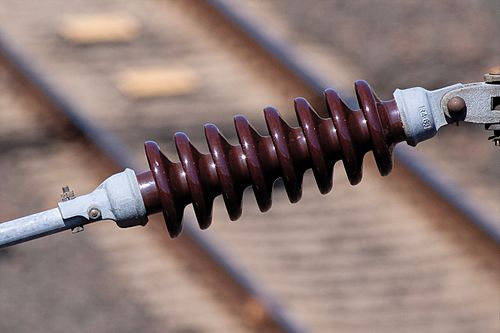
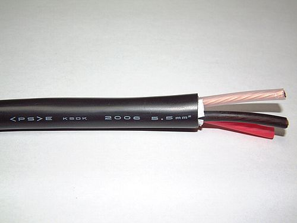

# insulators and conductors

An electrical **insulator (부도체)** is a material whose internal electric charges do not flow freely. A **conductor (도체)** is an object or type of material that allows the flow of charge (electrical current) in one or more directions.

Ceramic insulator used on electrified railways

3-core copper wire power cable, each core with individual colour-coded insulating sheaths all contained within an outer protective sheath

# Insulators

- glass
- wood
- plastics

# Conductors

- gold
- copper
- silver

# References

[Conductors and insulators](https://www.khanacademy.org/video/conductors-and-insulators)