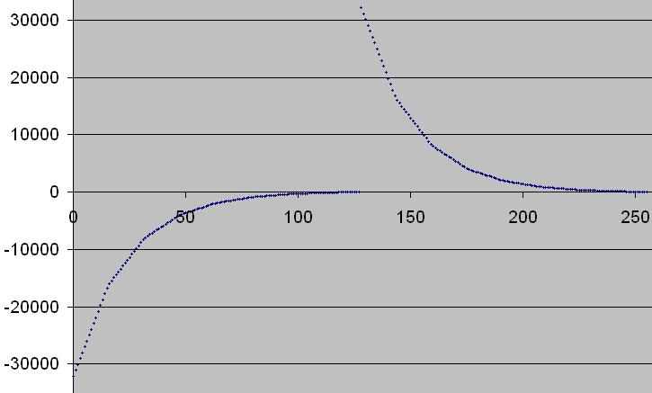

# mu-law

The **μ-law algorithm** (sometimes written "**mu-law**", often approximated as "**u-law**") is a companding algorithm, primarily used in 8-bit PCM digital telecommunication systems in North America and Japan.

# Algorithm types

## Continuous

For a given input x (-1 ≤ x ≤ 1), the equation for μ-law encoding is

$$F(x) := sign(x)\frac{\ln(1 + \mu|x|)}{\ln(1 + \mu)}$$

where μ = 255 in the North American and Japanese standards and sign(x) is the sign function. It is important to note that the range of this function is −1 to 1.

## Discrete

The discrete form is defined in ITU-T Recommendation G.711.

μ-law decoding as generated with the Sun Microsystems C-language routine g711.c commonly available on the Internet.

This plot illustrates how μ-law concentrates sampling in the smaller (softer) values. The abscissa represents the byte values 0-255 and the vertical axis is the 16-bit linear decoded value of μ-law encoding.

# Companding algorithm

**companding technique** provides more quantization steps at lower amplitude (volume) than at higher amplitude. The name is a portmanteau of the words compressing and expanding. The use of companding allows signals with a large dynamic range to be transmitted over facilities that have a smaller dynamic range capability

# Justification

μ-law encoding is used because [speech](https://en.wikipedia.org/wiki/Speech_communication) has a wide [dynamic range](https://en.wikipedia.org/wiki/Dynamic_range). In analog signal transmission, in the presence of relatively constant background noise, the finer detail is lost. Given that the precision of the detail is compromised anyway, and assuming that the signal is to be perceived as audio by a human, one can take advantage of the fact that the perceived [acoustic intensity level](https://en.wikipedia.org/wiki/Acoustic_intensity_level) or [loudness](https://en.wikipedia.org/wiki/Loudness) is logarithmic by compressing the signal using a logarithmic-response operational amplifier ([Weber-Fechner law](https://en.wikipedia.org/wiki/Weber-Fechner_law)). In telecommunications circuits, most of the noise is injected on the lines, thus after the compressor, the intended signal is perceived as significantly louder than the static, compared to an un-compressed source. This became a common solution, and thus, prior to common digital usage, the μ-law specification was developed to define an interoperable standard.

In digital systems this pre-existing algorithm had the effect of significantly reducing the number of bits needed to encode recognizable human voice. Using μ-law, a sample could be effectively encoded in as few as 8 bits, a sample size that conveniently matched the symbol size of most standard computers.

μ-law encoding effectively reduced the dynamic range of the signal, thereby increasing the [coding](https://en.wikipedia.org/wiki/Channel_coding) efficiency while biasing the signal in a way that results in a signal-to-[distortion](https://en.wikipedia.org/wiki/Distortion) ratio that is greater than that obtained by linear encoding for a given number of bits.

Companding algorithms reduce the dynamic range of an audio signal. In analog systems, this can increase the signal-to-noise ratio (SNR) achieved during transmission; in the digital domain, it can reduce the quantization error (hence increasing signal to quantization noise ratio). These SNR increases can be traded instead for reduced bandwidth for equivalent SNR.

# References

[μ-law algorithm](https://en.wikipedia.org/wiki/%CE%9C-law_algorithm)

[Aalto University Wiki](https://wiki.aalto.fi/display/ITSP/Waveform)

[Encyclopedia](https://www.pcmag.com/encyclopedia/term/47420/mu-law)

[Companding](https://en.wikipedia.org/wiki/Companding)

[What is mu-Law? - Definition from WhatIs.com](https://searchnetworking.techtarget.com/definition/mu-Law)