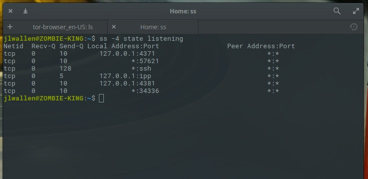

# netstat

`netstat` is a tool to look at **net**work **stat**istics.

# Deprecated

`netstat` is deprecated. The whole `net-tools` package was not maintained at least since 2011.

# Replaced by `ss`

`ss` is used to dump socket statistics. `ss` replaces `netstat` and can displays information in similar fashion (although simpler and faster) to `netstat`.

# Options

Shows both listening and non-listening sockets.

    $ netstat -a or --all    ->    ss -a or --all

Shows only listening sockets (which are omitted by netstat be default).

    $ netstat -l or --listening    ->    ss -l or --listening

Show numerical addresses instead of trying to determine symbolic host, port or user names (skips DNS translation).

    $ netstat -n or --numeric    ->    ss -n or --numeric

Shows the process ID (PID) and name of the program to which each socket belongs.

    $ netstat -p or --program    ->    ss -p or --processes

Filters results to display TCP only.

    $ netstat -t or --tcp    -> ss -t or --tcp

Filters results to display UDP only.

    $ netstat -u or --udp    ->    ss -u or --udp

# References

[Find Out What Ports Are Listening / Open On My Linux & FreeBSD Server - nixCraft](https://www.cyberciti.biz/faq/how-do-i-find-out-what-ports-are-listeningopen-on-my-linuxfreebsd-server/)

[Should I quit using Ifconfig?](https://serverfault.com/questions/458628/should-i-quit-using-ifconfig)

[Why is netstat deprecated?](https://unix.stackexchange.com/questions/278474/why-is-netstat-deprecated)

[Deprecated Linux networking commands and their replacements](https://dougvitale.wordpress.com/2011/12/21/deprecated-linux-networking-commands-and-their-replacements/)

[An Introduction to the ss Command](https://www.linux.com/learn/intro-to-linux/2017/7/introduction-ss-command)